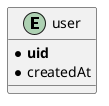

## はじめに

Cloud Functions for Firebase (以下、Cloud Functions という) は、サーバーレスのランタイム環境です。他のサーバーレスと同様に、HTTPS リクエストをトリガーにバックエンドコードを実行できます。

また、Firebase の他のサービスとの連携が可能です。
例えば、Firestore への書き込みをサブスクライブし関数を実行するほか、Firebase サービスをトリガーに、実に様々なことができます。
Firebase を使う上で、処理を疎結合に保つために非常に便利です。

サーバーレスは、本質的にその実行が副作用を持つことがほとんどです。そして、副作用を伴うコードはテストしにくいです。
特に、データベースへの書き込みなどは、E2E でテストしたいのにできない、もしくは煩雑になるということがあります。

また、クラウドサービスは [`Azure`](https://docs.microsoft.com/ja-jp/azure/cost-management-billing/manage/spending-limit) などを除いて基本的に課金額は青天井です。
ループなどが起きてしまうと莫大な課金額になってしまう事故も少なくありません。

そういった事故を防ぐためにも、自動テストによって堅牢なシステムの構築と心理的負荷の軽減をしましょう。

幸い、Cloud Functions には、公式ではメンテナンスされている [firebase-functions-test](https://www.npmjs.com/package/firebase-functions-test/) があります。
これを使って、実際にどのようにテストをするのか紹介します。

## Cloud Functions の注意点

Cloud Functions を使用するには、かなり前から従量課金の `Braze プラン` へのアップデートが必要になりました。
しかし、Braze プランには 呼び出し回数や CPU の使用時間など、一定の無料枠があります。
プロジェクトが小さいうちに課金されることはほぼないと思います。詳しくは [料金プラン](https://firebase.google.com/pricing) を確認してください。

ただし、Cloud Functions を**テストするだけ**であれば、Braze プランへのアップデートは不要です。

また、Cloud Functions のテストには、次の２つの方法があります。

- オンラインモード
- オフラインモード

### オンラインモード

オンラインモードでのテストは、公式で推奨されている方法です。Firebase の実際のリソースを使いテストを行います。
そのため、テスト専用の Firebase プロジェクトを作成することが推奨されます。

テスト専用のプロジェクトでは、無料の `Spark プラン` を超えるリソースを消費しない限り、Braze プランへのアップデートは不要です。

### オフラインモード

メモリ上に Firebase リソースを再現します。実際に Firebase リソースにアクセスするわけではないので、テスト用のプロジェクトは不要です。
また、文字通りオフラインで動作します。

一方、Firebase リソースとやり取りするメソッド呼び出しは、すべてスタブされなければならないため、テストが煩雑になります。
そして公式には次のように述べられています。

> Cloud Firestore または Realtime Database の関数を使用している場合は、テストコードが非常に複雑になるため、オフライン モードの使用はおすすめしません。

今回は、Cloud Firestore を使ったテストを行うため、オンラインモードでのテスト紹介します。

## アーキテクチャー

まず、アーキテクチャについて確認します。今回やりたいのは、サインアップ時にユーザー情報をデータベースへ保存するということです。

また、保存するデータは次のデータとします。



シンプルに uid と作成時のタイムスタンプを保持することとします。

### Firebase リソースをフル活用した場合

ユーザー管理には Firebase Authentication を使い、 ユーザーのサインアップを Cloud Functions でサブスクライブし、Cloud Firestore へデータを格納するという、
Firebase リソースをフル活用した構成で行うと次のようになります。

```plantuml
@startuml
left to right direction
!define FirebasePuml https://raw.githubusercontent.com/k2wanko/firebase-icons-plantuml/master/plantuml
!includeurl FirebasePuml/FirebaseCommon.puml
!includeurl FirebasePuml/FirebaseAll.puml

actor "User" as user
Authentication(auth, "Authentication", "User store")

package "Server" {
  Firestore(db, "Database", "Document Database")
  Functions(func, "onCreate", "Node14")
}


user ..> auth: sign up
func --> auth: subscribe
auth ..> func: publish
func ..> db: create
@enduml
```

それぞれのサービスが単一責任を持つため、シンプルでパフォーマンスが高く堅牢な構成になります。

### フロントエンドのみの場合

なお、ユーザーのサインアップからデータベースまでは繋がっているので、次のような構成ももちろん可能です。

```plantuml
@startuml
left to right direction
!define FirebasePuml https://raw.githubusercontent.com/k2wanko/firebase-icons-plantuml/master/plantuml
!includeurl FirebasePuml/FirebaseCommon.puml
!includeurl FirebasePuml/FirebaseAll.puml

actor "User" as user
Firestore(db, "Database", "Document Database")
Authentication(auth, "Authentication", "User store")

user ..> auth: sign up
auth ..> user: user info
user ..> db: create
@enduml
```

サインアップ後、ユーザー情報をフロントエンドから書き込むという方法です。
Cloud Functions を挟まない分こちらの構成のほうがわかりやすいかもしれません。

ただし、この構成だとフロントエンドで２度非同期処理を行う必要があります。
そのため、エラー処理を含めるとフロントエンドが肥大化しがちになります。

### バックグラウンドスレッドを用いた場合

また、上の一連の処理をメインスレッドからバックグラウンドスレッドへ移すことも可能です。
Firebase Authentication は、認証情報を `IndexedDB` に保持する事もできます。

そのため、 Web Worker でサインアップおよび DB への書き込みを行うことで、メインスレッドを専有せずに一連の処理を実行できます。

```plantuml
@startuml
left to right direction
!define FirebasePuml https://raw.githubusercontent.com/k2wanko/firebase-icons-plantuml/master/plantuml
!includeurl FirebasePuml/FirebaseCommon.puml
!includeurl FirebasePuml/FirebaseAll.puml

cloud "Sub thread" {
  () self
  Firestore(db, "Database", "Document Database")
  Authentication(auth, "Authentication", "User store")
}

actor "User" as user
[form]

user --> form: input
form ..> self: postMessage
self ..> db: create
self ..> auth: sign up
auth ..> self: user info
self ..> user: onmessage
@enduml
```

ユーザーがフォームへ入力したあと、`postMessage` を使ってワーカーへその情報を伝達します。
以下がそのイメージです。

```ts
const worker = new Worker('/auth.js')
worker.postMessage(/* formData */)

worker.addEventListener('onmessage', () => {
  // via worker
})
```

ワーカーからのメッセージは `onmessage` イベントから取得できます。

はい。複雑になりますね。Web Worker は基本的に重い処理をバックグラウンドスレッドで実行するために使います。
上の処理は特に重たい処理ではないため[^1]、無用な複雑性をもたらす可能性があります。

[^1]: メインのバンドルサイズを軽減する効果はあります。

以上のように、様々な方法がありますが、幸い Cloud Functions はユーザーのサインアップをサブスクライブできます。
そのため、疎結合でパフォーマンスの高い最初の構成を採用します。

## テストケース

ユーザーのサインアップ時に、ユーザー情報をデータベースに書き込むという部分をテストすることにします。
これは Cloud Functions だと次のようになります。

```ts
import * as functions from 'firebase-functions'
import { firestore, initializeApp } from 'firebase-admin'

initializeApp()

const onCreateUser = functions.auth
  .user()
  .onCreate(({ uid }, { timestamp }) => {
    return firestore()
      .collection('users')
      .doc(uid)
      .create({
        uid,
        createdAt: new Date(Date.parse(timestamp))
      })
  })

export { onCreateUser }
```

`onCreate` は、ユーザーのサインアップ時に呼ばれます。
また、その第１引数には、`UserRecord` 、第２引数には `EventContext` というデータが渡されます。
それぞれ次のような型です。

```ts{2,13}
interface UserRecord {
  uid: string
  email?: string
  emailVerified: boolean
  displayName?: string
  phoneNumber?: string
  photoURL?: string
  disabled: boolean
  // 省略
}

interface EventContext {
  timestamp: string // RFC 3339
  eventId: string
  eventType: string
  params: {
    [option: string]: any
  }
  resource: Resource
  // 省略
}
```

第１引数からは `uid`、 第２引数からは `timestamp` を取得します。
なお、`timestamp` は RFC 3339 の日時形式なため、 `Date` オブジェクトへ変換することで、
Cloud Firestore 上にタイムスタンプという型で保存できます。

実は、コンテキストの `timestamp` を使うのはテストを行う上で結構重要です。
タイムスタンプには  `new Date()` や、 `serverTimestamp()`[^2] も用いることができます。

[^2]: firestore.FieldValue.serverTimestamp

ただ、タイムスタンプを含むデータをテストする場合、その値は外部から与えられるようにすると、厳密なテストが行なえます。
コンテキストであればテスト時に注入できます。

要件にもよりますが、"タイムスタンプが DB の書き込み時間" といった厳密な要件でない限りは、コンテキストを使うことを推奨します。

また、Cloud Firestore ではドキュメント ID も `uid` にするとフィルターに便利です。
加えて、`initializeApp` は `firebase-admin` を利用する場合は先に１度だけ呼ばれる必要があります。

## テストの環境構築

Cloud Functions のテストには [firebase-functions-test](https://www.npmjs.com/package/firebase-functions-test/) を使います。
また、アサーション等は何でもいいですが、`jest` を使うことにします。

`jest` で TypeScript を使用したいので、トランスフォーマーに `@swc/jest` を使います。
`ts-jest` よりも高速に動作します。詳しくは [Jest で TypeScript を高速化する](/posts/speeding-up-jest/) を参照してください。

ちなみに `@swc/jest` 最新のバージョンはうまく動かないため、バージョン指定してインストールします。

<CodeGroups>
  <CodeGroup label="Yarn" active>

```bash
yarn add -D firebase-functions-test firebase-functions firebase-admin jest typescript @swc/jest@0.1.5
```

  </CodeGroup>

  <CodeGroup label="NPM">

```bash
npm i -D firebase-functions-test firebase-functions firebase-admin jest typescript @swc/jest@0.1.5
```

  </CodeGroup>
</CodeGroups>

jest の設定ファイルは次のようになります。

```json:jest.config.json{9}
{
  "clearMocks": true,
  "moduleFileExtensions": ["js", "ts"],
  "testEnvironment": "node",
  "transform": {
    "^.+\\.(t|j)sx?$": "@swc/jest"
  },
  "testMatch": ["**/*_test.ts"],
  "setupFiles": ["<rootDir>/test/setup.ts"]
}
```

`setupFiles` で各テストファイルが実行する前に実行する処理を行えます。
ここで、`firebase-admin`の `initializeApp` を行います。

```ts:test/setup.ts
import { initializeApp } from 'firebase-admin'
initializeApp()
```

さて、続いて`firebase-functions-test`の初期化を行います。
テストファイルを作成し、そこで初期化を行います。

```ts:onCreate_test.ts
import _test from 'firebase-functions-test'

const test = _test(
  {
    projectId: '<project_id>'
  },
  'path/to/serviceAccountKey.json'
)
```

`projectId` は Firebase のプロジェクト ID で、必須です。
今回は Cloud Firestore へのアクセスのみなため不要ですが、Cloud Storage や Realtime Database へアクセスする場合は、
他にもキーの指定が必要です。

また、第２引数にはサービスアカウントキーのパスを指定します。

[プロジェクト設定](https://console.firebase.google.com/u/0/project/blorogue/settings/serviceaccounts/adminsdk) から、`新しい秘密鍵の生成` でファイルを生成できます。
このファイルは公開してはなりません。

公式のドキュメントに詳しく書いてあるので、わからなければ [Cloud Functions の単体テスト](https://firebase.google.com/docs/functions/unit-testing?hl=ja) を参照してください。

さてこれで準備は完了です。

## テスト

`firebase-functions-test` を使うことで以下のような操作ができます。

- 対象の関数をラップし、実際にその関数に認証情報を付与して実行する
- モックの User や Cloud Firestore のスナップショットの生成
- Cloud Functions の config の設定
- テスト環境設定のクリーンアップ

まずは、テスト対象の関数をラップし、モックユーザーデータを作成します。

```ts:onCreate_test.ts
import { onCreateUser as _onCreateUser } from 'path/to/functions'

// 初期化した `firebase-functions-test` 関数を使う
const onCreateUser = test.wrap(_onCreateUser)
const user = test.auth.exampleUserRecord()

user.uid = 'fixed-user-id'
```

`exampleUserRecord` でモックユーザーデータを作成できます。
これはただのオブジェクトなので、 `uid` などは好きに変更できます[^3]。

[^3]: デフォルトではランダムな ID になります

これをラップした関数に渡すことで、実際に関数を実行します。

```ts:onCreate_test.ts
const timestamp = new Date('2021/1/1 00:01:02')

onCreateUser(user, {
  timestamp: timestamp.toISOString()
})
```

さて、これで実際に Cloud Firestore へ書き込みされました。この段階で実際のデータを確認してみるといいでしょう。

実際の関数では、タイムスタンプはコンテキストの値を参照していました。
コンテキストはラップ関数の第２引数に渡せます。

実際の関数でコンテキストの値を参照したことで、テストでは日時データを好きなように扱うことができます。

ここまできたので、あとは実際のデータを取得しアサートします。
少し長いですがテストの全体を載せます。

```ts:onCreate_test.ts{18,24-29,33}
import { onCreateUser as _onCreateUser } from 'path/to/functions'
import { firestore } from 'firebase-admin'
import _test from 'firebase-functions-test'

const test = _test(
  {
    projectId: '<project_id>'
  },
  'path/to/serviceAccountKey.json'
)

const onCreateUser = test.wrap(_onCreateUser)
const user = test.auth.exampleUserRecord()

describe('onCreateUser', () => {
  it('save user info to firestore /document/users/{uid}', async () => {
    const timestamp = new Date('2021/1/1 00:01:02')
    await onCreateUser(user, {
      timestamp: timestamp.toISOString()
    })

    const snapshot = await firestore().collection('users').doc(user.uid).get()

    expect(snapshot.exists).toBeTruthy()
    expect(snapshot.id).toBe(user.uid)
    expect(snapshot.data()).toEqual({
      uid: user.uid,
      createdAt: firestore.Timestamp.fromDate(timestamp)
    })
  })

  afterAll(async () => {
    await firestore().collection('users').doc(user.uid).delete()
  })
})
```

ポイントとしては、ラップ関数は非同期なため、 `await`で待った上で実際のデータを取得します。
また、アサーションによって、書き込まれたデータの完全なテストができています。

そして、実際に書き込みが行われているため、データの削除が必要です。
このデータの削除が結構めんどくさく、 `firebase-admin` で全てのコレクションおよびドキュメントを削除するメソッドはありません。

ただ、Firebase CLI には完全削除のコマンドがあります。

```bash
firebase firestore:delete --all-collections
```

クレデンシャルを誤ると大変なことになるので、気をつけて運用しましょう。

## おわりに

今回は Cloud Functions -> Cloud Firestore というフローをテストしました。
これを応用することで、Cloud Firestore -> Cloud Functions -> Cloud Firestore といった、最もループが起こりやすいパターンもテストすることができます。

また、他にも HTTP 関数についてもテストできます。

オフラインモードでのテストも機会があれば記事を書きたいと思います。お楽しみに。
