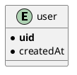

## Introduction

Cloud Functions for Firebase (hereafter referred to as Cloud Functions) is a serverless runtime environment. Like other serverless environments, it can execute backend code triggered by HTTPS requests.

It can also be integrated with other Firebase services.
For example, you can subscribe to Firestore writes, and do many other things triggered by Firebase services.
This is very useful for keeping the process loosely coupled when using Firebase.

Serverless by its very nature is almost always going to have side effects of its execution. And code with side effects is hard to test.

Also, with the exception of cloud services such as [`Azure`](https://docs.microsoft.com/ja-jp/azure/cost-management-billing/manage/spending-limit), there is basically no limit to how much you can charge.
It is not uncommon to have accidents that result in huge charges when loops occur.

In order to prevent such accidents, let's build a robust system and reduce the psychological burden by automated testing.

Fortunately, Cloud Functions has [firebase-functions-test](https://www.npmjs.com/package/firebase-functions-test/), which is officially maintained.
I will show you how to actually test using it.

## Notes on Cloud Functions

In order to use Cloud Functions, you need to update to the pay-as-you-go `Braze plan`.
However, the Braze plan has certain free quotas, such as the number of calls and CPU time used.
It is unlikely that you will be charged while your project is small. Check [Pricing plans](https://firebase.google.com/pricing) for details.

However, if you just want to **test** Cloud Functions, there is no need to update to the Braze plan.

There are two ways to test Cloud Functions:

- Online mode
- Offline mode

### Online mode

Testing in online mode is the officially recommended way to test, using real Firebase resources.
Therefore, it is recommended to create a dedicated Firebase project for testing.

The test-only project does not need to be updated to the Braze plan as long as it does not consume resources beyond the free `Spark plan`.

### Offline Mode

Recreates Firebase resources in memory. You don't need a project to test it, since it doesn't actually access Firebase resources.
Also, it literally works offline.

On the other hand, all method calls that interact with Firebase resources must be stubbed, which makes testing more complicated.
And here's what the official statement says

> Using offline mode is generally not recommended if you have Cloud Firestore or Realtime Database functions, since it greatly increases the complexity of your test code.

In this article, we will introduce testing in online mode because we will be using Cloud Firestore for testing.

## Architecture

First, let's review the architecture. What we want to do this time is to save the user information to the database when they sign up.

Also, the data to be saved is the following data.



We'll save the uid and the timestamp of the creation.

### Full use of Firebase resources

If we use Firebase Authentication for user management, subscribe to user signups with Cloud Functions, and store the data in Cloud Firestore, we will have the following configuration

```plantuml
@startuml
left to right direction
!define FirebasePuml https://raw.githubusercontent.com/k2wanko/firebase-icons-plantuml/master/plantuml
!includeurl FirebasePuml/FirebaseCommon.puml
!includeurl FirebasePuml/FirebaseAll.puml

actor "User" as user
Authentication(auth, "Authentication", "User store")

package "Server" {
  Firestore(db, "Database", "Document Database")
  Functions(func, "onCreate", "Node14")
}


user ..> auth: sign up
func --> auth: subscribe
auth ..> func: publish
func ..> db: create
@enduml
```

Since each service has a single responsibility, the configuration is simple, performant, and robust.

### Frontend only

Since the process from user sign-up to database is a series of steps, the following configuration is of course possible.

```plantuml
@startuml
left to right direction
!define FirebasePuml https://raw.githubusercontent.com/k2wanko/firebase-icons-plantuml/master/plantuml
!includeurl FirebasePuml/FirebaseCommon.puml
!includeurl FirebasePuml/FirebaseAll.puml

actor "User" as user
Firestore(db, "Database", "Document Database")
Authentication(auth, "Authentication", "User store")

user ..> auth: sign up
auth ..> user: user info
user ..> db: create
@enduml
```

This is the way to write user information from the frontend after signup.
This configuration may be easier to understand since it does not involve Cloud Functions.

However, this configuration requires asynchronous processing twice in the frontend.
Therefore, the front-end tends to become bloated if error handling is included.

### Using a background thread

It is also possible to move the above series of processes from the main thread to the background thread.
Firebase Authentication can also store authentication information in an `IndexedDB`.

Therefore, by using the Web Worker to sign up and write to the DB, a series of operations can be performed without occupying the main thread.

```plantuml
@startuml
left to right direction
!define FirebasePuml https://raw.githubusercontent.com/k2wanko/firebase-icons-plantuml/master/plantuml
!includeurl FirebasePuml/FirebaseCommon.puml
!includeurl FirebasePuml/FirebaseAll.puml

cloud "Sub thread" {
  () self
  Firestore(db, "Database", "Document Database")
  Authentication(auth, "Authentication", "User store")
}

actor "User" as user
[form]

user --> form: input
form ..> self: postMessage
self ..> db: create
self ..> auth: sign up
auth ..> self: user info
self ..> user: onmessage
@enduml
```

After the user fills out the form, we use `postMessage` to pass the information to the worker.
Here is an example.

```ts
const worker = new Worker('/auth.js')
worker.postMessage(/* formData */)

worker.addEventListener('onmessage', () => {
  // via worker
})
```

Messages from workers can be retrieved from the `onmessage` event.

Yes, it gets complicated. The Web Worker is basically used to run heavy processing in a background thread.
The above process is not particularly heavy [^1], and may introduce unnecessary complexity.

[^1]: It does have the effect of reducing the main bundle size.

As mentioned above, there are many ways to do this, but fortunately Cloud Functions can subscribe to user signups.
Therefore, we will adopt the first configuration, which is loosely coupled and performs well.

## Test case

We will test the part where user information is written to the database when a user signs up.
In Cloud Functions, this would look something like this:

```ts
import * as functions from 'firebase-functions'
import { firestore, initializeApp } from 'firebase-admin'

initializeApp()

const onCreateUser = functions.auth
  .user()
  .onCreate(({ uid }, { timestamp }) => {
    return firestore()
      .collection('users')
      .doc(uid)
      .create({
        uid,
        createdAt: new Date(Date.parse(timestamp))
      })
  })

export { onCreateUser }
```

`onCreate` is called when a user signs up.
Its first argument is a `UserRecord` and its second argument is an `EventContext`.
Each is of the following type:

```ts{2,13}
interface UserRecord {
  uid: string
  email?: string
  emailVerified: boolean
  displayName?: string
  phoneNumber?: string
  photoURL?: string
  disabled: boolean
  // omitted
}

interface EventContext {
  timestamp: string // RFC 3339
  eventId: string
  eventType: string
  params: {
    [option: string]: any
  }
  resource: Resource
  // omitted
}
```

You can get `uid` from the first argument and `timestamp` from the second argument.
Note that `timestamp` is in RFC 3339 date/time format, so you can save it as a timestamp in Cloud Firestore by converting it to a `Date` object.

Actually, using `timestamp` in context is quite important for testing.
You can also use `new Date()` or `serverTimestamp()`[^2] for timestamp.

[^2]: firestore.FieldValue.serverTimestamp

However, when testing data containing timestamps, it is recommended that the value be provided externally to ensure strict testing.
If it is a context, it can be injected at test time.

It depends on your requirements, but unless you have strict requirements such as "timestamp is DB write time", it is recommended to use contexts.

Also, in Cloud Firestore, it is useful to use the document ID as `uid` for filtering purposes.
In addition, `initializeApp` needs to be called only once first if you use `firebase-admin`.

## Build the testing environment

We will use [firebase-functions-test](https://www.npmjs.com/package/firebase-functions-test/) to test Cloud Functions.
Also, you can use any assertions, but we'll use `jest`.

Since we want to use TypeScript with `jest`, we'll use `@swc/jest` as the transformer.
It runs faster than `ts-jest`. See [Speeding up TypeScript with Jest](/posts/speeding-up-jest/) for details.

Note that the latest version of `@swc/jest` does not work well, so specify the version and install it.

<CodeGroups>
  <CodeGroup label="Yarn" active>

```bash
yarn add -D firebase-functions-test firebase-functions firebase-admin jest typescript @swc/jest@0.1.4
```

  </CodeGroup>

  <CodeGroup label="NPM">

```bash
npm i -D firebase-functions-test firebase-functions firebase-admin jest typescript @swc/jest@0.1.4
```

  </CodeGroup>
</CodeGroups>

The configuration file for jest looks like this:

```json:jest.config.json{9}
{
  "clearMocks": true,
  "moduleFileExtensions": ["js", "ts"],
  "testEnvironment": "node",
  "transform": {
    "^.+\\.(t|j)sx?$": "@swc/jest"
  },
  "testMatch": ["**/*_test.ts"],
  "setupFiles": ["<rootDir>/test/setup.ts"]
}
```

In `setupFiles`, you can specify the process to be executed before each test file is executed.
Here is the `firebase-admin` `initializeApp`.

```ts:test/setup.ts
import { initializeApp } from 'firebase-admin'
initializeApp()
```

Now, the next step is to initialize the `firebase-functions-test`.
We will create a test file and initialize it there.

```ts:onCreate_test.ts
import _test from 'firebase-functions-test'

const test = _test(
  {
    projectId: '<project_id>'
  },
  'path/to/serviceAccountKey.json'
)
```

The `projectId` is the Firebase project ID, and is required.
In this case, it is not necessary because we are only accessing Cloud Firestore, but if you want to access Cloud Storage or Realtime Database, you will need to specify other keys.

Also, specify the path to the service account key as the second argument.

From [Project Settings](https://console.firebase.google.com/u/0/project/blorogue/settings/serviceaccounts/adminsdk), you can generate a file with `Create key`.
This file should not be made public.

If you are not sure, please refer to [Unit testing of Cloud Functions](https://firebase.google.com/docs/functions/unit-testing) as the official documentation describes it in detail.

Now you are ready to go.

## Test

Using `firebase-functions-test`, you can do the following operations.

- Wrap the target function and actually execute it with the credentials attached to it
- Generate snapshots of mock User and Cloud Firestore
- Configure Cloud Functions config
- Clean up the test environment settings

First, wrap the function to be tested and create the mock user data.

```ts:onCreate_test.ts
import { onCreateUser as _onCreateUser } from 'path/to/functions'

// Use the initialized `firebase-functions-test` function
const onCreateUser = test.wrap(_onCreateUser)
const user = test.auth.exampleUserRecord()

user.uid = 'fixed-user-id'
```

You can create mock user data with `exampleUserRecord`.
This is just an object, so you can change the `uid` and so on as you like [^3].

[^3]: By default, it will be a random ID.

You can pass this to a wrapped function to actually execute the function.

```ts:onCreate_test.ts
const timestamp = new Date('2021/1/1 00:01:02')

onCreateUser(user, {
  timestamp: timestamp.toISOString()
})
```

Now, the data is actually written to Cloud Firestore. At this stage, it is a good idea to check the actual data.

In the actual function, the timestamp was referring to the context value.
The context can be passed as the second argument of the wrap function.

Now that we have referenced the context value in the actual function, we can handle the date and time data in our tests as we wish.

Now that we've done that, we just need to get the actual data and assert it.
Here's the whole test, which is a bit long.

```ts:onCreate_test.ts{18,24-29,33}
import { onCreateUser as _onCreateUser } from 'path/to/functions'
import { firestore } from 'firebase-admin'
import _test from 'firebase-functions-test'

const test = _test(
  {
    projectId: '<project_id>'
  },
  'path/to/serviceAccountKey.json'
)

const onCreateUser = test.wrap(_onCreateUser)
const user = test.auth.exampleUserRecord()

describe('onCreateUser', () => {
  it('save user info to firestore /document/users/{uid}', async () => {
    const timestamp = new Date('2021/1/1 00:01:02')
    await onCreateUser(user, {
      timestamp: timestamp.toISOString()
    })

    const snapshot = await firestore().collection('users').doc(user.uid).get()

    expect(snapshot.exists).toBeTruthy()
    expect(snapshot.id).toBe(user.uid)
    expect(snapshot.data()).toEqual({
      uid: user.uid,
      createdAt: firestore.Timestamp.fromDate(timestamp)
    })
  })

  afterAll(async () => {
    await firestore().collection('users').doc(user.uid).delete()
  })
})
```

The point is that the wrap function is asynchronous, so it waits for the `await` and then retrieves the actual data.
Also, the assertions allow for a complete test of the data being written.

And now that the actual writing is done, we need to delete the data.
Deleting this data is bit a hassle, and there is no method in `firebase-admin` to delete all collections and documents.

However, the Firebase CLI has a command for complete deletion.

```bash
firebase firestore:delete --all-collections
```

If you make a mistake with the credentials, you will be in trouble, so operate with care.

## Conclusion

In this article, we have tested the Cloud Functions -> Cloud Firestore flow.
By applying this, we can also test Cloud Firestore -> Cloud Functions -> Cloud Firestore, which is the most loop-prone pattern.

You can also test other HTTP functions as well.

I will write an article on testing in offline mode when I get a chance. Stay tuned.
