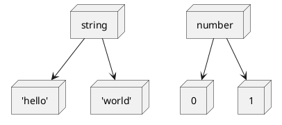

## はじめに

TypeScript で、次の型を定義するとどうなるでしょうか。

```ts
type WhatIsThis = 'what' | 'is' | 'this' | string
```

これは `string` 型にアップキャストされます。[リテラル型](https://www.typescriptlang.org/docs/handbook/2/everyday-types.html#literal-types)はそのリテラルが所属するデータ型の派生型です。

例えば文字列リテラル型はプリミティブ型 `string` の派生です。



[Union types](https://www.typescriptlang.org/docs/handbook/2/everyday-types.html#union-types)で プリミティブ型およびその派生リテラル型が指定された場合、プリミティブ型へキャストされます。

よって`ある特定の文字列` もしくは `その他` といった定義はできないのです。
ただしこうした場合、一般的にはインターフェイスを分離しますよね。

具体的に考えるために、色を指定するインターフェイスを考えます。

あるインターフェイスでは、色を指定するために `color` というプロパティを指定します。

```ts
type Options = {
  color: Theme
}

type Theme = 'primary' | 'secondary' | 'accent' | 'warinig' | 'error'
```

`color` は `Theme`の他に、ユーザーが指定した色を受け入れたいとします。
ユーザーの指定できる色のパターンは、`RGBA` や `Hex` などあります。
ここでは簡潔にするためそれらの型は `string`とします。

冒頭あるように、 文字列リテラル型と `string` を共用すると、キャストされてしまい型が台無しになります。

```ts
type Options = {
  color: Theme | string // string
}
```

そもそも、性質の異なるものを、インターフェイスとして共用することは良くないので分離します。

```ts
type Options = {
  theme: Theme
  color: string
}
```

これでわかりやすいインターフェイスになりました。しかし、一つ問題が起こります。
`theme` と `color` は、どちらかしか指定してほしくありません。
この型定義では両方指定しなければならないため、修正すると次のようになります。

```ts
type Options =
  | {
      theme: Theme
    }
  | {
      color: string
    }
```

この型定義、見た目では良さそうですがだめです。両方を指定しても型エラーは得られません。さてなぜしょう。

この記事ではこのような場合の排他的なプロパティの定義について解説します。

## Union types と オブジェクトリテラル型

元々あったこの型は何がいけなかったのでしょう。

```ts
type Options =
  | {
      theme: Theme
    }
  | {
      color: string
    }
const options: Options = {
  theme: 'primary',
  color: '##FFFFFF'
}
```

TypeScript の型システムは[構造的部分型](https://www.typescriptlang.org/docs/handbook/type-compatibility.html)を採用しています。余剰のプロパティについては、型システム上禁じられていません。

つまり、上の型ではそれぞれが余剰のプロパティとなるため、なんら問題ないわけです。

```ts
const options: Options = {
  theme: 'primary', // excess property Ok
  color: '##FFFFFF' // excess property Ok
}
```

### Discriminated Union

では Union types の オブジェクトリテラル型は判別できないのかというとそうではありません。
[Discriminated Union](https://www.typescriptlang.org/docs/handbook/typescript-in-5-minutes-func.html#discriminated-unions) というパターンによって、
Union types からひとつのメンバーに絞り込むことができます。

Discriminated Union には、必ず共通のプロパティが必要になります。
またそのプロパティは<u>一意に特定できる型</u>[^1]である必要があります。

[^1]:
    これはしばしば `singleton types`と呼ばれます。
    [Enum Member Types](https://www.typescriptlang.org/docs/handbook/advanced-types.html#enum-member-types)

#### 一意に特定できる型とは

リテラル型がその代表ですが、必ずしもそうとは限りません。
あり得るパターンを見てみましょう。

#### 異なるリテラル型

共通のプロパティキーの型が異なるリテラル型の場合、Discriminated Union によりひとつに判別できます。
例えば次のようにです。

```ts
type Options =
  | {
      type: 0
      fn: (val: string) => string
    }
  | {
      type: 1
      fn: (val: number) => string
    }
```

２つのオブジェクトリテラルは `type` という共通のプロパティキーを持っています。
また、 `0` か `1` という数値リテラル型 によって一意に特定できます。

よって `type` に与える型によって、 `fn` の引数の型を変えることができます。

```ts
const options: Options = {
  type: 0,
  fn: (val) => '' // (val: string) => string
}
```

#### リテラル型とそのリテラルのデータ型

最初に見たように文字列リテラル型は `string` 型の派生です。
また、 Union types の際はアップキャストされます。

そのため、リテラル型とそのリテラルのデータ型の組み合わせは <u>一意に特定できる型</u>とはなりません。

```ts
type Options =
  | {
      type: 'primary'
      fn: (val: string) => string
    }
  | {
      type: string
      fn: (val: number) => string
    }

const options: Options = {
  type: 'primary',
  fn: (val) => '' // (val: any) => string
}
```

しかし、興味深いことに、 `'primary'` という文字列以外では正しく推論されます。

```ts
const options: Options = {
  type: 'other than primary',
  fn: (val) => '' // (val: number) => string
}
```

これは`primary` 以外の文字列は `string` のみにマッチするからです。
このことから、一意に特定できれば、リテラル型でなくとも良いことがわかります。

もう少し見てみましょう。

#### リテラル型とそのリテラルとは別のデータ型

続いては次のパターンです。早速見てみましょう。

```ts
type Options =
  | {
      type: 0
      fn: (val: string) => string
    }
  | {
      type: string
      fn: (val: number) => string
    }

const options: Options = {
  type: 0
  fn: (val) => '' // (val: string) => string
}

const options2: Options = {
  type: 'any string',
  fn: (val) => '' // (val: number) => string
}
```

`0` という数値リテラル型と、 `string` 型が候補にあった場合です。
それぞれの型には互換性がないので、一意な特定ができます。
パターンが見えてきましたね。

#### データ型とデータ型

ここで、残念ながら今までの前提には但し書きがつくことになります。

`string` と `number` というデータ型の場合について見てみます。

```ts
type Options =
  | {
      type: string
      fn: (val: string) => string
    }
  | {
      type: number
      fn: (val: number) => string
    }
const options: Options = {
  type: 'primary',
  fn: (val) => '' // (val: any) => string
}
```

データ型が異なるため、一見うまくいきそうですがだめです。
判定要素がデータ型のみの場合、Discriminated Union により判別はできません。

これに `PropertyKey`[^2] 以外の型が加わると、正しく判別できるようになります。

[^2]: `string` | `number` | `symbol`

```ts
type Options =
  | {
      type: string
      fn: (val: string) => string
    }
  | {
      type: number
      fn: (val: number) => string
    }
  | {
      type: boolean
      fn: (val: boolean) => string
    }
const options: Options = {
  type: 'primary',
  fn: (val) => '' // (val: string) => string
}
```

`boolean` というデータ型を加えたため、すべてが判別可能になりました。
一方、 `symbol` 型を加えても結果は変わりませんでした。

また、文字列リテラルや数値リテラルを加えると、興味深い結果になります。

```ts
type Options =
  | {
      type: string
      fn: (val: string) => string
    }
  | {
      type: number
      fn: (val: number) => string
    }
  | {
      type: ''
      fn: (val: boolean) => string
    }
const options: Options = {
  type: 0,
  fn: (val) => '' // (val: number) => string
}
const options2: Options = {
  type: '',
  fn: (val) => '' // (val: any) => string
}
const options3: Options = {
  type: 'other than empty',
  fn: (val) => '' // (val: string) => string
}
```

`''` 以外の文字列と、`number` 型で正しく動作するようになりました。

以上から、`PropertyKey` 型のみの場合、一意に特定することができないことがわかりました。
ただ正直、この理由についてはよくわかりません。この点に詳しい方いれば、コメントいただけるとありがたいです。

とはいえ、`PropertyKey` 以外の型を加わることで、一意な絞り込みができるとわかりました。

## 排他型の定義

先に得た前提によって、排他プロパティの定義ができます。

こんな例題でしたね。

```ts
type Options =
  | {
      theme: Theme
    }
  | {
      color: string
    }
```

それぞれを一意に絞り込むため、互いにないプロパティを補完します。
`PropertyKey`以外の型として `undefined`[^3]型を指定します。
また、そのプロパティは Optional にします。

[^3]: `never` 型でも結果は同じです。

以下のようになります。

```ts
type Options =
  | {
      theme: Theme
      color?: undefined
    }
  | {
      theme?: undefined
      color: string
    }
```

`theme` を指定した場合、もう一つのメンバーは `{ theme?: undefined }`を持つため、一つの型に絞られます。
さらに`color` はオプショナルなので、指定しなくても型エラーはありません。オプショナルすら無くす方法はおそらくありません。

逆に`color` を指定した場合も同様のロジックになります。
どちらにも対応できるように、お互いにないプロパティをすべて補完しているわけです。

これによって、`theme` と `color` が同時に指定できないインターフェイスになりました[^4]。

[^4]: `undefined` のみ受け付けます。

さらに 片方にしかない型を加えても正しく動作します。

例えば、`theme` ではダークモードを選べるとき、次のようになります。

```ts
type Options =
  | {
      theme: Theme
      color?: never
      mode?: 'light' | 'dark'
    }
  | {
      theme?: never
      color: string
    }
```

これは、 `theme` が指定されているときのみ、オプションで `mode` を指定できます。
他の排他定義によって、型が一つに絞られることによって実現できます。

さて、つぎはこれを一般化しましょう。

## フラット構造の排他型の定義

以下では、排他型の Utility types を作り方を解説します。
ちなみに TypeScript 用に Utility types を定義した[utilitypes](https://github.com/TomokiMiyauci/utilitypes/tree/main)というプロジェクトを作りました。

今回はフラット構造の説明のみとしますが、このライブラリはネスト構造のオブジェクトリテラルも扱える `Exclusive` という型を提供しています。

さて、ここではフラットなデータ構造の場合を考えます。

データ構造がフラットである場合、考えることはひとつです。
それは、自分にないプロパティを オプショナルな `undefined` にすることです。

次のようになります。

```ts{5}
type Exclusive<
  T extends Record<PropertyKey, unknown>,
  U extends Record<PropertyKey, unknown>
> =
  | (T & { [k in Exclude<keyof U, keyof T>]?: never })
  | (U & { [k in Exclude<keyof T, keyof U>]?: never })
```

まず、ジェネリクスで`T` と `U` を定義します。
このジェネリクスは、オブジェクトリテラル型に制約にしたいので、 `Record<PropertyKey, unknown>` とします。

`keyof` は プロパティキー を Union types で列挙します。

例えば `keyof { a: string, b: number }` は `'a' | 'b'` になります。
組み込み Utility types の `Exclude` は Union types から指定した型を取り除いた型を返します。

よって、 「`U` 型のプロパティキーから `T` 型のプロパティキーを除いたすべてのプロパティを、 `never`にした型」と `T` を交差しています。
これはまさに、先程定義した型と同じです。

お互いが同じプロパティしか持たない場合どうなるでしょう。

```ts
type Ab = { a: 0; b: 1 } | { a: 'a'; b: 'b' }

type Never = Exclude<'a' | 'b', 'a' | 'b'> // never
type empty = { [k in never]?: never} // {}

Exclusive<Ab> // ({} & { a: 0; b: 1 }) | ({} & { a: 'a'; b: 'b' })
```

同じプロパティキーしか持たない場合、`Exclusive` はそのまま同じ型を返します。
同じプロパティを持ちかつリテラル型が存在しているので、そもそも不要だったというわけです。

### 排他型の制約

同じプロパティキーの場合そのまま型を返すので、
上で問題にあげた 同じプロパティキーかつ `PropertyKey` のみで構成されている場合は対応できません。

```ts
type NotSupport = { a: string; b: number } | { a: number; b: string }
```

ただ、基本的に排他プロパティを定義する場合、プロパティが同じ名前のインターフェイスにするのはあまり良くない事が多いです。
排他を定義することの背景には、データの性質が異なっているのが要因なことが多いためです。
そういった場合は、たいてい別々の適切な名前をつけることができます。

どうしても同じ場合にする場合でも排他ではなく、ジェネリクスにすることで対応する方法もあります。

```ts
type Good<
  T extends string | number,
  U extends T extends string ? number : string
> = { a: T; b: U }

const good: Good<string, number> = {
  a: '',
  b: 1
}
```

## おまけ

最後に `react` を使って、排他 props をやってみます。UI フレームワークのようなものを作っていると仮定します。
散々例に出た `theme` と `color` が排他的になってます。

```tsx
import React, { FC } from 'react'

type ButtonProps = {
  onClick: () => void
} & Exclusive<
  {
    theme: Theme
    mode?: 'light' | 'dark'
  },
  {
    color: string
  }
>
type Theme = 'primary' | 'secondary' | 'accent' | 'warinig' | 'error'

const Button: FC<ButtonProps> = () => {
  return <button />
}
```

`react` の場合は排他 props が定義できますが、コンポーネントライブラリによって、できないものもあります。

`vue3` では　新しい `setup` 記法でもできませんでした。 `vue` は props 間の連携に制約があります。

`svelte` でも排他 props ができました。`$$Props`の定義することでできましたが、あまり `svelte`に詳しくないので説明できません。
興味ある方は[実装](https://github.com/TomokiMiyauci/utterances-component/blob/beta/packages/svelte/lib/Utterances.svelte)を確認してください。

排他 props によって、 UX の高いライブラリの開発ができるかもしれませんね。
