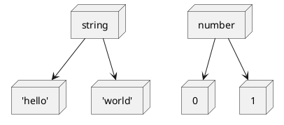

## Introduction

What happens when you define the following types in TypeScript?

```ts
type WhatIsThis = 'what' | 'is' | 'this' | string
```

It will be upcast to type `string`. A [literal type](https://www.typescriptlang.org/docs/handbook/2/everyday-types.html#literal-types) is a derived type of the data type to which the literal belongs.

For example, the string literal type is a derivative of the primitive type `string`.



If a primitive type and its derived literal types are specified in [Union types](https://www.typescriptlang.org/docs/handbook/2/everyday-types.html#union-types), they are cast to the primitive type.

Therefore, it is not possible to define `a specific string` or `other`.
However, in such a case, we generally separate the interfaces, right?

To be more specific, consider the interface for specifying colors.

In one interface, the property `color` is used to specify the color.

```ts
type Options = {
  color: Theme
}

type Theme = 'primary' | 'secondary' | 'accent' | 'warinig' | 'error'
```

`color` accepts user-specified colors in addition to `Theme`.
There are many color patterns that can be specified by the user, such as `RGBA` and `Hex`.
For the sake of brevity, we'll assume their type is `string`.

As mentioned at the beginning, if you share `string` with a string literal type, it will be casted and the type will be ruined.

```ts
type Options = {
  color: Theme | string // string
}
```

In the first place, it is not a good idea to share an interface between things with different properties, so separate them.

```ts
type Options = {
  theme: Theme
  color: string
}
```

Now we have an interface that is easy to understand. However, there is one problem.
We don't want either `theme` or `color` to be specified.
In this typedef, both must be specified, so the fix will look like this

```ts
type Options =
  | {
      theme: Theme
    }
  | {
      color: string
    }
```

This type definition looks good, but it's not. If I specify both, I don't get a type error. Why is that?

In this article, I will explain how to define exclusive properties in such cases.

## Union types and object literal types

What was wrong with the original types?

```ts
type Options =
  | {
      theme: Theme
    }
  | {
      color: string
    }
const options: Options = {
  theme: 'primary',
  color: '#ffffff'
}
```

The TypeScript type system uses [structural subtyping](https://www.typescriptlang.org/docs/handbook/type-compatibility.html). Surplus properties are not forbidden by the type system.

In other words, each of the above types is an excess property, so there is no problem.

```ts
const options: Options = {
  theme: 'primary', // excess property Ok
  color: '#ffffff' // excess property Ok
}
```

### Discriminated Union

So how should we determine the object literal type of Union types?
The pattern [Discriminated Union](<(https://www.typescriptlang.org/docs/handbook/typescript-in-5-minutes-func.html#discriminated-unions)>) allows you to narrow down the union types to a single member.

A Discriminated Union must have a common property.
The property must be a <u>uniquely identifiable type</u>[^1].

[^1]:
    This is often referred to as `singleton types`.
    [Enum Member Types](https://www.typescriptlang.org/docs/handbook/advanced-types.html#enum-member-types)

#### What is a uniquely identifiable type?

Literal types are the most common, but not necessarily so.
Let's look at some possible patterns.

#### Different literal types pair

If the types of common property keys are of different literal types, they can be identified as one by Discriminated Union.
For example

```ts
type Options =
  | {
      type: 0
      fn: (val: string) => string
    }
  | {
      type: 1
      fn: (val: number) => string
    }
```

The two object literals have a common property key called `type`.
They can also be uniquely identified by their numeric literal types, `0` or `1`.

Thus, the type of the argument of `fn` can be changed depending on the type given to `type`.

```ts
const options: Options = {
  type: 0,
  fn: (val) => '' // (val: string) => string
}
```

#### Literal types and the data types of those literals

As we saw at the beginning, the string literal type is a derivative of the `string` type.
Also, they are upcasted in Union types.

Therefore, the combination of a literal type and its literal data type is not a <u>uniquely identifiable type</u>.

```ts
type Options =
  | {
      type: 'primary'
      fn: (val: string) => string
    }
  | {
      type: string
      fn: (val: number) => string
    }

const options: Options = {
  type: 'primary',
  fn: (val) => '' // (val: any) => string
}
```

However, interestingly, it is correctly inferred for all but the string `'primary'`.

```ts
const options: Options = {
  type: 'other than primary',
  fn: (val) => '' // (val: number) => string
}
```

This is because any string other than `primary` will only match `string`.
This shows that it doesn't have to be a literal type, as long as it can be uniquely identified.

Let's take a closer look.

#### literal type and a data type different from its literal

Let's look at it quickly.

```ts
type Options =
  | {
      type: 0
      fn: (val: string) => string
    }
  | {
      type: string
      fn: (val: number) => string
    }

const options: Options = {
  type: 0
  fn: (val) => '' // (val: string) => string
}

const options2: Options = {
  type: 'any string',
  fn: (val) => '' // (val: number) => string
}
```

This is the case when the candidate types are a numeric literal `0` and a `string`.
Since each type is incompatible, they can be uniquely identified.
You are starting to see a pattern.

#### Data types and datatypes

Here, unfortunately, there will be a proviso to the assumptions made so far.

Let's look at the case of the data types `string` and `number`.

```ts
type Options =
  | {
      type: string
      fn: (val: string) => string
    }
  | {
      type: number
      fn: (val: number) => string
    }
const options: Options = {
  type: 'primary',
  fn: (val) => '' // (val: any) => string
}
```

It seems to work, but it doesn't, because the data types are different.
If the element is only a data type, it cannot be discriminated by Discriminated Union.

If you add a type other than `PropertyKey`[^2], it will work correctly.

[^2]: `string` | `number` | `symbol`

```ts
type Options =
  | {
      type: string
      fn: (val: string) => string
    }
  | {
      type: number
      fn: (val: number) => string
    }
  | {
      type: boolean
      fn: (val: boolean) => string
    }
const options: Options = {
  type: 'primary',
  fn: (val) => '' // (val: string) => string
}
```

Since we added the `boolean` data type, everything is now distinguishable.
On the other hand, adding the `symbol` type did not change the result.

Also, adding string literals and numeric literals produced interesting results.

```ts
type Options =
  | {
      type: string
      fn: (val: string) => string
    }
  | {
      type: number
      fn: (val: number) => string
    }
  | {
      type: ''
      fn: (val: boolean) => string
    }
const options: Options = {
  type: 0,
  fn: (val) => '' // (val: number) => string
}
const options2: Options = {
  type: '',
  fn: (val) => '' // (val: any) => string
}
const options3: Options = {
  type: 'other than empty',
  fn: (val) => '' // (val: string) => string
}
```

It now works correctly with strings other than `''` and with the type `number`.

From the above, it turns out that the `PropertyKey` type alone is not uniquely identifiable.
But to be honest, I don't know the reason for this. If you know more about this point, I would appreciate your comments.

Nevertheless, I found out that adding types other than `PropertyKey` will allow me to narrow down the search uniquely.

## Defining exclusive types

The assumption we got earlier allows us to define an exclusive property.

It was an example like this.

```ts
type Options =
  | {
      theme: Theme
    }
  | {
      color: string
    }
```

Complement properties that are not present in each other to make each one unique.
Specify the type `undefined`[^3] as a type other than `PropertyKey`.
Also, its properties should be Optional.

[^3]: The result is the same for the `never` type.

The result is as follows:

```ts
type Options =
  | {
      theme: Theme
      color?: undefined
    }
  | {
      theme?: undefined
      color: string
    }
```

If you specify `theme`, the other member will have `{ theme?: undefined }`, so you are limited to one type.
Furthermore, `color` is optional, so there is no type error if you don't specify it. There is probably no way to remove even the optional.

On the other hand, if you specify `color`, the logic will be the same.

This makes the interface such that `theme` and `color` cannot be specified at the same time [^4].

[^4]: Only `undefined` is accepted.

In addition, adding a type that is only available in one of them will work correctly.

For example, in `theme`, when you can choose a dark mode, it looks like this

```ts
type Options =
  | {
      theme: Theme
      color?: never
      mode?: 'light' | 'dark'
    }
  | {
      theme?: never
      color: string
    }
```

This is only available when `theme` is specified, with the option `mode`.
This can be achieved by limiting the type to one by other exclusion definitions.

Now let's generalize this.

## Defining exclusive types for flat structures

In the following, I will explain how to create Utility types for exclusive types.
For your information, I have created a project called [utilitypes](https://github.com/TomokiMiyauci/utilitypes/tree/main) that defines Utility types for TypeScript.

This time, I will only explain the flat structure, but this library provides a type called `Exclusive` that can also handle nested object literals.

Now, let's consider the case of a flat data structure.

If your data structure is flat, there is only one thing to think about.
It is to make the property what not defined optional `undefined`.

It looks like this:

```ts{5}
type Exclusive<
  T extends Record<PropertyKey, unknown>,
  U extends Record<PropertyKey, unknown>
> =
  | (T & { [k in Exclude<keyof U, keyof T>]?: never })
  | (U & { [k in Exclude<keyof T, keyof U>]?: never })
```

First, we define `T` and `U` in generics.
This generic should be `Record<PropertyKey, unknown>` since we want to constrain it to an object literal type.

`keyof` enumerates property keys in Union types.

For example, `keyof { a: string, b: number }` will be `'a' | 'b'`.
Built-in Utility types `Exclude` returns the Union types without the specified types.

Thus, it intersects `T` with "A type that has `never` all the property keys of type `U` except for those of type `T`".
This is exactly the same as the type we just defined.

What happens if they both have only the same properties?

```ts
type Ab = { a: 0; b: 1 } | { a: 'a'; b: 'b' }

type Never = Exclude<'a' | 'b', 'a' | 'b'> // never
type empty = { [k in never]?: never} // {}

Exclusive<Ab> // ({} & { a: 0; b: 1 }) | ({} & { a: 'a'; b: 'b' })
```

If you have only the same property keys, `Exclusive` will return the same type as it is.
Since they have the same properties and literal type, they were not needed in the first place.

### Constraints for exclusive types

Since the same property key returns the same type, the
The same property key with only `PropertyKey` is not supported.

```ts
type NotSupport = { a: string; b: number } | { a: number; b: string }
```

But basically, When defining an exclusive property, it is not a good idea to have the property be an interface with the same name.
The reason behind defining exclusions is that the nature of the data is often different.
In such cases, it is usually possible to give them different and appropriate names.

Even if you have to do it in the same case, there is a way to deal with it by making it generic rather than exclusive.

```ts
type Good<
  T extends string | number,
  U extends T extends string ? number : string
> = { a: T; b: U }

const good: Good<string, number> = {
  a: '',
  b: 1
}
```

## Appendix

Finally, let's use `react` to do exclusive props, assuming you are building something like a UI framework.
The `theme` and `color` are exclusive.

```tsx
import React, { FC } from 'react'

type ButtonProps = {
  onClick: () => void
} & Exclusive<
  {
    theme: Theme
    mode?: 'light' | 'dark'
  },
  {
    color: string
  }
>
type Theme = 'primary' | 'secondary' | 'accent' | 'warinig' | 'error'

const Button: FC<ButtonProps> = () => {
  return <button />
}
```

In the case of `react`, you can define exclusive props, but depending on the component library, you may not be able to.

In `vue3`, even with the new `setup` notation, I couldn't do it. `vue` is limited in its integration between props.

Exclusive props are now possible in `svelte`. This was done by defining `$$Props`, but I'm not very familiar with `svelte`, so I can't explain it.
If you are interested, please check the [implementation](https://github.com/TomokiMiyauci/utterances-component/blob/beta/packages/svelte/lib/Utterances.svelte).

It may be possible to develop a library with high UX by using exclusive props.
