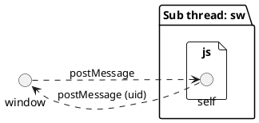

## はじめに

2021 年 8 月 25 日、ついに Firebase SDK @9.0.0 がメジャーリリースされました。
晴れて安定版がリリースされたことで、今後 V9 モジューラー SDK への移行が加速するでしょう。

さて、V9 モジューラー SDK は、主にバンドルサイズの削減を目的としたリリースでした。
コードベースは、クラス型の記述スタイルから、関数へ移行しました。
これにより、バンドラーのツリーシェイキングを最大限生かせるようになりました。

Firebase Authentication に関しては、最大でバンドルサイズを 70%程度削減することができるようです。
どの程度バンドルサイズが削減されたかについては、[Firebase のモジュラー SDK でバンドルサイズ比較](/posts/firebase-bundle-size/) を確認ください。

ただ、残念ながら依然としてサイズ問題は存在します。

例えば `initializeAuth` という関数は、 `firebase/auth` モジュールを使用する際必ず行う初期化関数ですが、
この関数だけでおよそ `90kb` 程度あります。

今回は、Firebase Authentication を Service Worker で使い、パフォーマンス改善の方法を紹介します。

## Firebase Authentication の認証の種類

Firebase Authentication では、認証として主に２つの種類があります。
この分類は、認証タイミングと能動関係の違いを表しています。

- ユーザー認証
- 匿名認証

### ユーザー認証

ユーザー認証は、ユーザーが能動的に行う認証です。メールアドレスや認証プロバイダーを使用して認証を行います。

Firebase Authentication のモジュールを読み込むタイミングは、ユーザーが `submit` するか、
認証専用ページをリクエストしたタイミングまで遅延することができます。

[Service Worker によるセッション管理](https://firebase.google.com/docs/auth/web/service-worker-sessions?hl=ja) ではバックエンドが存在するアプリケーションを例に、Service Worker を利用する方法を紹介しています。

### 匿名認証

匿名認証を行うタイミングは、構成によって様々でしょうが、基本的に受動的に行われます。
多くの場合、ページの読み込み時でなくとも良く、ユーザーインタラクション[^1]後でも問題ないでしょう。

[^1]: クリックイベントやスクロールイベントなど、ユーザーが操作後に発火するイベント

また、認証自体の処理は、UI を伴う必要性が薄いです。
この場合、メインスレッドで認証処理を行うのではなく、バックグラウンドスレッドに処理を移行できます。

バックグラウンドスレッドで処理を行うことで、UI を妨げることなく処理を実行できます。
また、基本的には CWV[^2]が向上します。

[^2]: Core Web Vitals

## Service worker で Firebase Authentication を使う

今回の目的はパフォーマンス改善です。 `initializeAuth` をメインスレッドで行わないことでパフォーマンスを改善させます。

Service Worker での Firebase SDK は モジュールバンドラーを使い、バンドルすることを前提に解説します。

CDN から `importScripts` を用いて読み込む場合は適宜読み替えてください。

加えて、認証情報の永続化には `Indexed DB` が利用されます。 `Indexed DB` が実装されていないブラウザは利用できないため注意してください。

<p
  class="ciu_embed"
  data-feature="indexeddb"
  data-periods="future_1,current,past_1,past_2"
  data-accessible-colours="true"
>
  <picture>
    <source
      type="image/webp"
      srcset="https://caniuse.bitsofco.de/image/indexeddb.webp"
    />
    <source
      type="image/png"
      srcset="https://caniuse.bitsofco.de/image/indexeddb.png"
    />
    
  </picture>
</p>

まず、既にある場合は不要ですが、Firebase SDK をインストールします。

<CodeGroups>
  <CodeGroup label="Yarn" active>

```bash
yarn add firebase@9
```

  </CodeGroup>

  <CodeGroup label="NPM">

```bash
npm i firebase@9
```

  </CodeGroup>
</CodeGroups>

今後、`sw.ts` という一つのファイルで説明しますが、実際は適宜ファイル分割をしてください。

続いて、`firebase/auth` を初期化します。

```ts:sw.ts
import { initializeApp } from 'firebase/app'
import { initializeAuth } from 'firebase/auth'

const app = initializeApp(/* firebaseOptions */)
const auth = initializeAuth(app)
```

Service Worker は大きな特徴として http リクエストのプロキシとなることが挙げられます。
`fetch` イベントにアタッチすることで、http リクエストをハイジャックできます。

これを利用し、特定のリソースに対するリクエストの際、 認証情報をヘッダーへ付与することができます。
匿名の認証情報を付与する場合は、次のようになります。

```ts:sw.ts
const whitelist = ['https://firestore.googleapis.com']

self.addEventListener('fetch', async (ev) => {
  const requestProcessor = async (): Promise<Response> => {
    const url = new URL(ev.request.url)

    if (whitelist.includes(url.origin)) {
      const user = await getUser(auth)

      if (user) {
        const idToken = await getIdToken(user)
        const request = makeAuthRequest(ev.request, idToken)
        return fetch(request)
      }
    }

    return fetch(ev.request)
  }

  ev.respondWith(requestProcessor())
})
```

ここでは、特定のオリジンに対して、認証トークンを付与しています。

サインインと、トークンを付与したリクエストオブジェトを作成するヘルパー関数を作ると便利です。

```ts:sw.ts{12,21}
import { onAuthStateChanged, signInAnonymously } from 'firebase/auth'
import type { User, Auth } from 'firebase/auth'
} from 'firebase/auth'

const getUser = (auth: Auth): Promise<User | undefined> =>
  new Promise<User | undefined>((resolve) => {
    const unsubscribe = onAuthStateChanged(auth, async (user) => {
      unsubscribe()
      if (user) {
        resolve(user)
      } else {
        const { user } = await signInAnonymously(auth).catch(() => ({
          user: undefined
        }))
        resolve(user)
      }
    })
  })

const makeAuthRequest = (req: Request, idToken: string): Request => {
  const headers = new Headers(req.headers)
  headers.set('Authorization', `Bearer ${idToken}`)
  const request = new Request(req, {
    headers
  })
  return request
}
```

`Request` オブジェクトの `headers` は読み取り専用なので、 `Headers` オブジェクトは新たに作成しなければならない点に注意が必要です。

また、`fetch` イベントリスナーは `iframe` などのサードパーティへのリクエストもハイジャックするため、全てのリクエストに認証情報を付与するべきではありません。

例では、Cloud Firestore のエンドポイントに対してのみ認証トークンを付与しています。

### Service Worker をすぐにアクティベートする

Service Worker がすぐにアクティベートされるように設定します。
Service Worker は登録されたあと、ページがもう一度読み込まれるまで有効化されません。

認証は Service Worker 登録後すぐに使いたい機能なため、`Clients.claim()` メソッドを使い、登録後すぐにアクティベートします。

```ts:sw.ts
self.addEventListener('activate', (ev) => {
  ev.waitUntil(self.clients.claim())
})
```

あとはフロントエンドから、Service Worker を登録するだけです。

### Service Worker をビルドする

上の例は、 TypeScript と NPM モジュールを利用しています。
ブラウザで利用するためには、TypeScript はトランスパイルが必要ですし、 NPM モジュールはバンドルしなければなりません。

理想的には、メインバンドラーに Service Worker のビルドも任せたいところです。
しかし、残念ながら Service Worker のモジュールのバンドルまでサポートしているものは少ないです。

その実情を踏まえて、`esbuild` を使って別プロセスでビルドする方法を例示します。
Web workers は別スレッドで動作するため、メインビルドとは切り離してビルドプロセスを構築できます。

まず、 `esbuild` をインストールします。

<CodeGroups>
  <CodeGroup label="Yarn" active>

```bash
yarn add -D esbuild
```

  </CodeGroup>

  <CodeGroup label="NPM">

```bash
npm i -D esbuild
```

  </CodeGroup>
</CodeGroups>

`esbuild` は CLI で動作するコマンドを提供しているため、それを利用します[^3]。

[^3]: JavaScript API も提供しているため、ビルドプロセスが複雑になった場合はそちらの利用を推奨します。

<CodeGroups>
  <CodeGroup label="Yarn" active>

```bash
yarn esbuild sw.ts --outdir=<outdir> --bundle --sourcemap --minify --format=esm --legal-comments=external
```

  </CodeGroup>

  <CodeGroup label="NPM">

```bash
npm run esbuild sw.ts --outdir=<outdir> --bundle --sourcemap --minify --format=esm --legal-comments=external
```

  </CodeGroup>
</CodeGroups>

`outdir` に メインビルドの出力先のルートディレクトリを指定します。

これでバンドル済みの Service Worker ファイルが出力されます。

あとはフロントエンドから Service Worker の登録をします。

```ts
if ('serviceWorker' in window.navigator) {
  window.navigator.serviceWorker.register('/sw.js')
}
```

これで Service Worker が利用できるようになりました。

開発環境でも Service Worker をテストするためには、ビルドプロセスの工夫が必要です。
詳しくは [build.ts](https://github.com/TomokiMiyauci/me/blob/next/scripts/build.ts) を参考にしてください。

## 匿名認証で Cloud Firestore を使う

匿名認証を導入する背景には、多くの場合 Cloud Firestore を利用していることでしょう。
現状は、認証部分だけワーカースレッドへ移行しました。

ここで問題なのは、 `uid` を取得するタイミングです。
Cloud Firestore で `uid` をドキュメントの ID として管理するパターンは王道です。
その場合、事前に `uid` を知る必要があります。

現状では、 Service Worker が `fetch` イベントを取得したタイミングでしか `uid` を知る方法がありません。
Indexed DB から取得する方法も一応ありますが、一度 `fetch` イベントが発生しなければなりません。

さて、この問題を解決するために `postMessage` を使って、service worker とメッセージングします。

### Service Worker とメッセージングする

まず、現状を整理すると次のようになります。

```plantuml
@startuml
left to right direction
!define FirebasePuml https://raw.githubusercontent.com/k2wanko/firebase-icons-plantuml/master/plantuml
!includeurl FirebasePuml/FirebaseCommon.puml
!includeurl FirebasePuml/FirebaseAll.puml

file "Sub thread: sw.js" {
  node "firebase/auth"
  () self
}

cloud "GCP" {
  Authentication(auth, "Authentication", "User store")
  Firestore(db, "Database", "/users/{uid}")
}

actor "User" as user
node "firebase/firestore"

user ..> self: fetch hijack
self ..> auth: sign in or sign up
auth ..> self: user info
self ..> db: fetch
@enduml
```

ユーザーがメインスレッドから `fetch` したタイミングでは、まだ `uid` を知ることができません。
これは `uid` を含むクエリが発行できないことを意味しています。

Service Worker とメインスレッドとは、 `postMessage` を利用しメッセージのやり取りができます。
`fetch` 以外の別のタイミングで `uid` をやり取りしてみます。

Service Worker では、`message` イベントを登録することで、クライアントからのメッセージを待ち受けます。

```ts:sw.ts
self.addEventListener('message', async ({ source }) => {
  const user = await getUser(auth)
  source.postMessage(user.uid)
})
```

`postMessage` を使い、クライアントにメッセージを送信します。ここでは  `uid` を送信しています。

残念ながら `postMessage` を使って送信できるメッセージには制限があります。
[構造化複製アルゴリズム](https://developer.mozilla.org/ja/docs/Web/API/Web_Workers_API/Structured_clone_algorithm) を使って、JavaScript オブジェクトを複製できるもののみが送信できます。

例えば、メソッドを持つクラスオブジェクトは送信できません。そのため、ここでは `uid` のみを送信しているわけです。

クライアント側では、次のようにメッセージの送受信をします。

```ts
const sw = window.navigator.serviceWorker

sw.ready.then((registration) => {
  // send
  registration.active?.postMessage('')
})

// receive
sw.addEventListener(
  'message',
  ({ data }) => {
    // data is uid
  },
  {
    once: true
  }
)
```

active な Service Worker に対して、 `postMessage` でメッセージを送信します。
Service Worker からのメッセージは、 `message` イベントで取得できます。



これで `uid` を取得できました。このやり取りは非同期なため、Cloud Firestore へリクエストする際は、 `uid` が取得できるまで待機するか、
リクエストの前に毎回上の処理を行うなどの対応が必要になります。

## おわりに

パフォーマンスの観点からは、理想的には UI を伴わない処理はすべてワーカースレッドへ移行することが望ましいです。
しかし、往々にしてパフォーマンスの最適化と引き換えに複雑性をもたらします。

上の方法だけでなく、実は `firebase/firestore` モジュールを Web worker で使う方法もあります。

またの機会に、 Web worker と Cloud Firestore について書きたいと思います。
