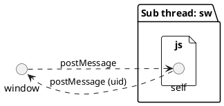

## Introduction

On August 25, 2021, Firebase SDK @9.0.0 was finally released as a major release.
With the release of the stable version, the migration to the V9 Modular SDK will be accelerated.

Now, the V9 Modular SDK was released mainly to reduce the bundle size.
The code base has moved from a class style of writing to functions.
This allows us to take full advantage of the tree-shaking in Bandler.

As for Firebase Authentication, it seems to be able to reduce the bundle size by up to 70%.
Please check [Bundle size comparison in Firebase modular SDK](/posts/firebase-bundle-size/) to see how much the bundle size has been reduced.

Unfortunately, the size problem still exists.

For example, the function `initializeAuth` is an initialization function that must be performed when using the `firebase/auth` module.
This function alone is about `90kb`.

In this article, I will show you how to use Firebase Authentication with Service Worker to improve performance.

## Types of authentication in Firebase Authentication

In Firebase Authentication, there are two main types of authentication.
This classification represents the difference in authentication timing and active relationship.

- User Authentication
- Anonymous Authentication

### User Authentication

User authentication is an active authentication performed by the user. It uses an email address or an authentication provider to authenticate.

The timing of loading the Firebase Authentication module can be delayed until the user `submit` or requests an authentication-only page.

In [Session management with service workers](https://firebase.google.com/docs/auth/web/service-worker-sessions),
introduce how to use Service Worker with an example of an application that has a backend.

### Anonymous Authentication

The timing of anonymous authentication may vary depending on the configuration, but it is basically passive.
In most cases, it does not have to be at page load time, and can be done after user interaction [^1].

[^1]: Events that fire after user interaction, such as click events and scroll events.

In addition, the authentication process itself does not need to involve the UI.
In this case, instead of doing the authentication process in the main thread, the process can be moved to the background thread.

By doing the processing in the background thread, the processing can be done without disturbing the UI.
It also basically improves the CWV [^2].

[^2]: Core Web Vitals

## Using Firebase Authentication with Service worker

The purpose of this project is to improve performance. We will improve the performance by not doing `initializeAuth` in the main thread.

This article assumes that the Firebase SDK in Service Worker is bundled using the module bundler.

If you want to use `importScripts` to load them from CDN, please change it accordingly.

In addition, `Indexed DB` will be used to persist authentication information. Note that browsers that do not implement `Indexed DB` cannot be used.

<p
  class="ciu_embed"
  data-feature="indexeddb"
  data-periods="future_1,current,past_1,past_2"
  data-accessible-colours="true"
>
  <picture>
    <source
      type="image/webp"
      srcset="https://caniuse.bitsofco.de/image/indexeddb.webp"
    />
    <source
      type="image/png"
      srcset="https://caniuse.bitsofco.de/image/indexeddb.png"
    />
    
  </picture>
</p>

First, install the Firebase SDK, although this is not necessary if you already have it.

<CodeGroups>
  <CodeGroup label="Yarn" active>

```bash
yarn add firebase@9
```

  </CodeGroup>

  <CodeGroup label="NPM">

```bash
npm i firebase@9
```

  </CodeGroup>
</CodeGroups>

I will use a single file, `sw.ts`, but you can split the file as needed.

Next, we will initialize `firebase/auth`.

```ts:sw.ts
import { initializeApp } from 'firebase/app'
import { initializeAuth } from 'firebase/auth'

const app = initializeApp(/* firebaseOptions */)
const auth = initializeAuth(app)
```

One of the main features of Service Worker is that it proxies http requests.
By attaching to the `fetch` event, you can hijack http requests.

This can be used to add credentials to the header when requesting a specific resource.
To add anonymous credentials, you can do the following:

```ts:sw.ts
const whitelist = ['https://firestore.googleapis.com']

self.addEventListener('fetch', async (ev) => {
  const requestProcessor = async (): Promise<Response> => {
    const url = new URL(ev.request.url)

    if (whitelist.includes(url.origin)) {
      const user = await getUser(auth)

      if (user) {
        const idToken = await getIdToken(user)
        const request = makeAuthRequest(ev.request, idToken)
        return fetch(request)
      }
    }

    return fetch(ev.request)
  }

  ev.respondWith(requestProcessor())
})
```

Here, we are granting an authentication token to a specific origin.

It is useful to create a helper function to sign in and create a request object with the token.

```ts:sw.ts{12,21}
import { onAuthStateChanged, signInAnonymously } from 'firebase/auth'
import type { User, Auth } from 'firebase/auth'
} from 'firebase/auth'

const getUser = (auth: Auth): Promise<User | undefined> =>
  new Promise<User | undefined>((resolve) => {
    const unsubscribe = onAuthStateChanged(auth, async (user) => {
      unsubscribe()
      if (user) {
        resolve(user)
      } else {
        const { user } = await signInAnonymously(auth).catch(() => ({
          user: undefined
        }))
        resolve(user)
      }
    })
  })

const makeAuthRequest = (req: Request, idToken: string): Request => {
  const headers = new Headers(req.headers)
  headers.set('Authorization', `Bearer ${idToken}`)
  const request = new Request(req, {
    headers
  })
  return request
}
```

Note that the `Headers` object of the `Request` object is read-only, so you will have to create a new `Headers` object.

Also, the `fetch` event listener will also hijack requests to third parties such as `iframe`, so you should not provide credentials for all requests.

In our example, we only give authentication tokens to Cloud Firestore endpoints.

### Activate Service Worker Immediately

Configure the Service Worker to be activated immediately.
After the Service Worker is registered, it will not be activated until the page is loaded again.

Since authentication is a feature we want to use immediately after registering the Service Worker, we will use the `Clients.claim()` method to activate it immediately after registration.

```ts:sw.ts
self.addEventListener('activate', (ev) => {
  ev.waitUntil(self.clients.claim())
})
```

All you need to do is register the Service Worker from the frontend.

### Build the Service Worker

The above example uses TypeScript and NPM modules.
TypeScript needs to be transpiled and NPM module needs to be bundled in order to be used in the browser.

Ideally, I would like to let the main bundler build the Service Worker as well.
However, unfortunately, not many of them support bundling Service Worker modules.

With that in mind, here is an example of how to build them in a separate process using `esbuild`.
Since web workers runs in a separate thread, the build process can be separated from the main build.

First, install `esbuild`.

<CodeGroups>
  <CodeGroup label="Yarn" active>

```bash
yarn add -D esbuild
```

  </CodeGroup>

  <CodeGroup label="NPM">

```bash
npm i -D esbuild
```

  </CodeGroup>
</CodeGroups>

Since `esbuild` provides commands that work in the CLI, we will use them [^3].

[^3]: It also provides a JavaScript API, so we recommend using that if the build process gets too complicated.

<CodeGroups>
  <CodeGroup label="Yarn" active>

```bash
yarn esbuild sw.ts --outdir=<outdir> --bundle --sourcemap --minify --format=esm --legal-comments=external
```

  </CodeGroup>

  <CodeGroup label="NPM">

```bash
npm run esbuild sw.ts --outdir=<outdir> --bundle --sourcemap --minify --format=esm --legal-comments=external
```

  </CodeGroup>
</CodeGroups>

For `outdir`, specify the root directory where the main build will be output.

This will output the bundled Service Worker file.

Now we need to register the Service Worker from the frontend.

```ts
if ('serviceWorker' in window.navigator) {
  window.navigator.serviceWorker.register('/sw.js')
}
```

The Service Worker is now ready to be used.

In order to test the Service Worker in the development environment as well, you need to devise a build process.
For details, please refer to [build.ts](https://github.com/TomokiMiyauci/me/blob/next/scripts/build.ts).

## Using Cloud Firestore with Anonymous Authentication

In many cases, you may be using Cloud Firestore as a background for implementing anonymous authentication.
Currently, only the authentication part has been migrated to the worker thread.

The problem here is when to get the `uid`.
The pattern of managing `uid` as the ID of a document in Cloud Firestore is a classic.
In that case, we need to know the `uid` in advance.

Currently, there is no way to know the `uid` except when the Service Worker gets the `fetch` event.
There is also a way to get it from the Indexed DB, but the `fetch` event has to be fired once.

Now, to solve this problem, we will use `postMessage` to message the service worker.

### Messaging with Service Worker

First, the current situation can be summarized as follows:

```plantuml
@startuml
left to right direction
!define FirebasePuml https://raw.githubusercontent.com/k2wanko/firebase-icons-plantuml/master/plantuml
!includeurl FirebasePuml/FirebaseCommon.puml
!includeurl FirebasePuml/FirebaseAll.puml

file "Sub thread: sw.js" {
  node "firebase/auth"
  () self
}

cloud "GCP" {
  Authentication(auth, "Authentication", "User store")
  Firestore(db, "Database", "/users/{uid}")
}

actor "User" as user
node "firebase/firestore"

user ..> self: fetch hijack
self ..> auth: sign in or sign up
auth ..> self: user info
self ..> db: fetch
@enduml
```

At the time the user `fetch` from the main thread, the `uid` is not yet known.
This means that a query containing the `uid` cannot be issued.

Service Worker and the main thread can exchange messages using `postMessage`.
Let's try to exchange `uid` at another timing other than `fetch`.

The Service Worker waits for messages from clients by registering a `message` event.

```ts:sw.ts
self.addEventListener('message', async ({ source }) => {
  const user = await getUser(auth)
  source.postMessage(user.uid)
})
```

Use `postMessage` to send a message to the client. Here, we are sending `uid`.

Unfortunately, there is a limit to the messages that can be sent using `postMessage`.
Only messages that can duplicate a JavaScript object using the [The structured clone algorithm](https://developer.mozilla.org/en-US/docs/Web/API/Web_Workers_API/Structured_clone_algorithm) can be sent.

For example, a class object with methods cannot be sent, so only the `uid` is sent here.

On the client side, messages are sent and received as follows:

```ts
const sw = window.navigator.serviceWorker

sw.ready.then((registration) => {
  // send
  registration.active?.postMessage('')
})

// receive
sw.addEventListener(
  'message',
  ({ data }) => {
    // data is uid
  },
  {
    once: true
  }
)
```

Sends a message to an active Service Worker with `postMessage`.
The message from the service worker can be retrieved with the `message` event.



Now you can get the `uid`.
Since this exchange is asynchronous, you need to either wait until you get the `uid` when making a request to Cloud Firestore.

## Conclusion

From a performance point of view, ideally, all processes without UI should be migrated to worker threads.
However, this often leads to complexity at the cost of performance optimization.

In addition to the above, there is actually a way to use the `firebase/firestore` module with web workers.

I would like to write about web workers and Cloud Firestore in the future.
