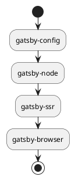

## はじめに

Gatsby を TypeScript 化するという名目のもと、コンポーネントや graphql を対象に解説している記事は多くあります。
しかし、Gatsby config への言及はほとんど見かけませんでした。

設定ファイルの型安全性は、コンポーネント等と同様に大切です。
この記事では、Gatsby config に焦点を当てて、 TypeScript 化の方法について解説します。

## Gatsby config のモジュールシステム

まず、Gatsby config のモジュールシステムについて簡単にまとめました。

| File           | Module system                  | Types of export                                                   |
| -------------- | ------------------------------ | ----------------------------------------------------------------- |
| gatsby-browser | `ES Modules` &#124; `CommonJS` | 名前付きエクスポート                                              |
| gatsby-config  | `CommonJS`                     | デフォルトエクスポート                                            |
| gatsby-node    | `CommonJS`                     | 名前付きエクスポート                                              |
| gatsby-ssr     | `ES Modules` &#124; `CommonJS` | API がエクスポートされていると読み込まれる。 名前付きエクスポート |

`ES Modules` と `CommonJS` のみ言及しています。

特徴としては、`gatsby-config` と `gatsby-node` は `CommonJS` を前提としています。
一方、 `gatsby-browser` と `gatsby-ssr` は、`ES Modules`と`CommonJS` の両方を利用できます。
また、 エクスポートの方法も、 API が複数ある場合は Named Exports にする必要があります[^1]。

[^1]: ここでは TypeScript 化した際の、ES6 でのエクスポートの方法について言及しています。

さらに、`gatsby-ssr` は少し特殊な挙動をします。
`gatsby-ssr` が実行されるには、[Gatsby SSR APIs](https://www.gatsbyjs.com/docs/reference/config-files/gatsby-ssr/)が名前付きエクスポートされている必要があります。

名前付きエクスポートがない場合は実行されません。

```js:gatsby-ssr.js
console.log('not exec')
```

実行される例:

```js:gatsby-ssr.js
console.log('exec')

const onRenderBody = () => {
  console.log('onRenderBody')
}

export {
  onRenderBody
}
```

```bash
exec
onRenderBody
```

またデフォルトエクスポートではエクスポートしたことにはなりません。

```js:gatsby-ssr.js
const onRenderBody = () => {
  console.log('not exec')
}

export default { onRenderBody }
```

さらに、すべての config に共通して、 `.ts` や `.tsx` などの拡張子は、デフォルトでは読み込みません。

これらの状況を理解した上で、 Gatsby  の設定ファイルを完全に TypeScript 化し、型安全に運用できようにします。

## Gatsby config の読込み順

Gatsby config は次の順に読み込まれます。



`gatsby-config` が設定ファイルの中で一番最初に読み込まれます。

そこでまずは、はじめに読み込まれる `gatsby-config` について見てみます。

## gatsby-config を TypeScript 化する

まず、TypeScript をトランスパイルするために [`esbuild-register`](https://github.com/egoist/esbuild-register)をインストールします。

<CodeGroups>
  <CodeGroup label="Yarn" active>

```bash
yarn add -D esbuild-register
```

  </CodeGroup>

  <CodeGroup label="NPM">

```bash
npm i -D esbuild-register
```

  </CodeGroup>
</CodeGroups>

`gatsby-config` は、 `CommonJS` 形式の `.js` ファイルでなければならないため、このまま残します。
そして、新しく `gatsby-config.ts` をどこでもいいので作成します。
今回は ルートディレクトリ下へ作成しました。

```bash
.
├── gatsby-browser.js
├── gatsby-config.js
├── gatsby-config.ts
├── gatsby-node.js
└── gatsby-ssr.js
```

今後、`gatsby-config.ts` に型付きで設定をしていくことになります。
次のようになります。

```ts:gatsby-config.ts
import type { GatsbyConfig } from 'gatsby'
import { resolve } from 'path'

const plugins: GatsbyConfig['plugins'] = [
  'gatsby-plugin-image',
  {
    resolve: 'gatsby-source-filesystem',
    options: {
      name: 'posts',
      path: resolve(__dirname, 'posts')
    }
  },
  ...
]

const siteMetadata: GatsbyConfig['siteMetadata'] = {
  siteUrl: 'https://miyauchi.dev/',
}

const config: GatsbyConfig = {
  siteMetadata,
  plugins
}

export default config
```

`GatsbyConfig` という型が提供されているので、型注釈に利用します。
最終的にデフォルトエクスポートすればいいので、適宜変数を分割できます。
あまりにも `plugin` が肥大化してきた場合は、ファイル分割してもいいでしょう。

パスを指定する場合は、 `__dirname` を使って、絶対パスで指定すると間違いが起こりにくいです。

このファイルを `gatsby-config.js` から読み込めばいいわけです。

## esbuild-register で 実行時にトランスパイルする

`esbuild-register` で実行時に TypeScript をトランスパイルできます。

`gatsby-config.js` を次のように変更します。

```js:gatsby-config.js
const { register } = require('esbuild-register/dist/node')

register({
  target: 'node16'
})

module.exports = require('./gatsby-config.ts')
```

ここでは２つのことをしています。

- `esbuild-register` により、 TypeScript を `esbuild` でトランスパイルする
- `gatsby-config.js`で `gatsby-config.ts` を re-export する

`esbuild-register`は、[`ts-node`](https://github.com/TypeStrong/ts-node) と比較すると、型チェックがなく、Rust で記述されている分、高速に動作します。

これで、 `gatsby-config` の TypeScript 化が完了しました。

また、一番最初に読み込まれる `gatsby-config` で `esbuild-register` を実行しているので、
他の config ファイルの TypeScript は自動的に `esbuild` でトランスパイルされます。

よって、`gatsby-config` 以外のファイルは、 `.ts` にして型注釈をつけるだけです。

`gatsby-node`:

```ts:gatsby-node.ts
import type { GatsbyNode } from 'gatsby'
import { resolve } from 'path'
const createPages: GatsbyNode['createPages'] = async ({
  graphql,
  actions,
  reporter
}) => {
  // ...
}

export { createPages }
```

`tsx`ももちろん扱うことができます。

`gatsby-ssr`:

```tsx:gatsby-ssr.tsx
import React from 'react'
import type { GatsbySSR } from 'gatsby'

const wrapPageElement: GatsbySSR['wrapPageElement'] = ({
  element,
}) => {
  return <div className='wrap'>{element}</div>
}

export { wrapPageElement }
```

`gatsby-browser`:

```tsx:gatsby-browser.tsx
import React from 'react'
import type { GatsbyBrowser } from 'gatsby'

const wrapPageElement: GatsbyBrowser['wrapPageElement'] = ({
  element,
}) => {
  return <div className='wrap'>{element}</div>
}

export { wrapPageElement }
```

基本的に 名前付きエクスポートをしなければならない点に注意してください。
Gatsby で基本的な型は提供されているので、型注釈するだけですね。

## まとめ

最終的には次のファイル構造になります。

```bash
.
├── gatsby-browser.tsx
├── gatsby-config.js
├── gatsby-config.ts
├── gatsby-node.ts
└── gatsby-ssr.txs
```

`gatsby-config` が最も最初に読み込まれるため、`gatsby-config.js` をエントリーポイントにしています。
`gatsby-config.js` で　`esbuild-register` を登録することで、以降のファイルでは TypeScript がトランスパイルされます。

ただ、残念ながら　`gatsby-config.js` をなくす方法はわかりません。
これをなくすには gatsby コマンド時に　`esbuild-register` を登録しなければなりません。

例えば `node.js` ではコマンド引数として `-r` があり、 `esbuild-register` を引数に渡すことができます。

```bash
node -r esbuild-register a.ts
```

これにより、TypeScript ファイルをトランスパイルし、実行することができます。
同じように、 gatsby コマンド実行時に、 `esbuild-register` を登録できれば、
`gatsby-config.js` すらなくすことができるかもしれません。

この点について知っている方いれば、コメントお願いします。

ともあれ、これで型安全な運用ができますね。
