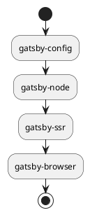

## Introduction

There are many articles on Gatsby that deal with components and graphql with TypeScript.
However, I have rarely seen any mention of Gatsby config.

Type-safety of configuration files is just as important as components.
In this article, I will focus on Gatsby config and explain how to use with TypeScript.

## Gatsby config's module system

First, I briefly summarized the module system of Gatsby config.

| File           | Module system                  | Types of export                                                |
| -------------- | ------------------------------ | -------------------------------------------------------------- |
| gatsby-browser | `ES Modules` &#124; `CommonJS` | Named Exports                                                  |
| gatsby-config  | `CommonJS`                     | Default Exports                                                |
| gatsby-node    | `CommonJS`                     | Named Exports                                                  |
| gatsby-ssr     | `ES Modules` &#124; `CommonJS` | If the API has been exported, it will be loaded. Named Exports |

Only `ES Modules` and `CommonJS` are mentioned.

As for features, `gatsby-config` and `gatsby-node` assume `CommonJS`.
On the other hand, `gatsby-browser` and `gatsby-ssr` can use both `ES Modules` and `CommonJS`.
Also, If there are multiple APIs, they need to be Named Exports[^1].

[^1]: This section mentions how to export in ES6 with TypeScript.

In addition, `gatsby-ssr` behaves a bit differently.
In order for `gatsby-ssr` to run, the [Gatsby SSR APIs](https://www.gatsbyjs.com/docs/reference/config-files/gatsby-ssr/) must have a Named Exports.

If there is no Named Exports, it will not be executed.

```js:gatsby-ssr.js
console.log('not exec')
```

Example to be executed:

```js:gatsby-ssr.js
console.log('exec')

const onRenderBody = () => {
  console.log('onRenderBody')
}

export {
  onRenderBody
}
```

```bash
exec
onRenderBody
```

Also, the Default Exports does not mean that you have exported.

```js:gatsby-ssr.js
const onRenderBody = () => {
  console.log('not exec')
}

export default { onRenderBody }
```

Additionally, in common with all configs, extensions such as `.ts` and `.tsx` are not loaded by default.

With these situations in mind, let's make Gatsby's configuration files fully TypeScript so that they can be run in a type-safe manner.

## The order in which Gatsby config is read

Gatsby config will be loaded in the following order.



The `gatsby-config` will be loaded first in the configuration file.

So let's take a look at `gatsby-config`.

## gatsby-config with TypeScript

First, install [`esbuild-register`](https://github.com/egoist/esbuild-register) to transpile TypeScript.

<CodeGroups>
  <CodeGroup label="Yarn" active>

```bash
yarn add -D esbuild-register
```

  </CodeGroup>

  <CodeGroup label="NPM">

```bash
npm i -D esbuild-register
```

  </CodeGroup>
</CodeGroups>

Since `gatsby-config` must be a `.js` file in `CommonJS` format, we will leave `gatsby-config.js` as is.
Then, create a new `gatsby-config.ts` file anywhere you want.
In this case, I created it under the root directory.

```bash
.
├── gatsby-browser.js
├── gatsby-config.js
├── gatsby-config.ts
├── gatsby-node.js
└── gatsby-ssr.js
```

From now on, we will configure `gatsby-config.ts` with types.
It will look like this:

```ts:gatsby-config.ts
import type { GatsbyConfig } from 'gatsby'
import { resolve } from 'path'

const plugins: GatsbyConfig['plugins'] = [
  'gatsby-plugin-image',
  {
    resolve: 'gatsby-source-filesystem',
    options: {
      name: 'posts',
      path: resolve(__dirname, 'posts')
    }
  },
  ...
]

const siteMetadata: GatsbyConfig['siteMetadata'] = {
  siteUrl: 'https://miyauchi.dev/',
}

const config: GatsbyConfig = {
  siteMetadata,
  plugins
}

export default config
```

A type `GatsbyConfig` is provided, which we will use for type annotations.
You can split the variables as you see fit, since you can just export the defaults in the end.
If the `plugin` becomes too bloated, you can split the file.

When specifying a path, use `__dirname` to specify the absolute path to avoid mistakes.

You can load this file from `gatsby-config.js`.

## Transpile at runtime with esbuild-register

TypeScript can be transpiled at runtime with `esbuild-register`.

Change `gatsby-config.js` as follows:

```js:gatsby-config.js
const { register } = require('esbuild-register/dist/node')

register({
  target: 'node16'
})

module.exports = require('./gatsby-config.ts')
```

We are doing two things here.

- `esbuild-register` to transpile TypeScript with `esbuild`.
- `gatsby-config.js` to re-export `gatsby-config.ts`.

`esbuild-register` is faster than [`ts-node`](https://github.com/TypeStrong/ts-node) because it has no type checking.

This completes `gatsby-config`.

Also, since `esbuild-register` is executed in `gatsby-config`, which is the first file loaded
TypeScript in other config files will be automatically transpiled by `esbuild`.

So, for files other than `gatsby-config`, you only need to set them to `.ts` and add type annotations.

`gatsby-node`:

```ts:gatsby-node.ts
import type { GatsbyNode } from 'gatsby'
import { resolve } from 'path'
const createPages: GatsbyNode['createPages'] = async ({
  graphql,
  actions,
  reporter
}) => {
  // ...
}

export { createPages }
```

Of course, `tsx` can also be available.

`gatsby-ssr`:

```tsx:gatsby-ssr.tsx
import React from 'react'
import type { GatsbySSR } from 'gatsby'

const wrapPageElement: GatsbySSR['wrapPageElement'] = ({
  element,
}) => {
  return <div className='wrap'>{element}</div>
}

export { wrapPageElement }
```

`gatsby-browser`:

```tsx:gatsby-browser.tsx
import React from 'react'
import type { GatsbyBrowser } from 'gatsby'

const wrapPageElement: GatsbyBrowser['wrapPageElement'] = ({
  element,
}) => {
  return <div className='wrap'>{element}</div>
}

export { wrapPageElement }
```

Note that you basically have to do a Named Exports.
Gatsby provides the basic types, so I just need to annotate the types.

## Summary

The end result is the following file structure:

```bash
.
├── gatsby-browser.tsx
├── gatsby-config.js
├── gatsby-config.ts
├── gatsby-node.ts
└── gatsby-ssr.txs
```

We use `gatsby-config.js` as the entry point because `gatsby-config` is loaded first.
Registering `esbuild-register` in `gatsby-config.js` will cause TypeScript to be transpiled in subsequent files.

Unfortunately, we don't know how to get rid of `gatsby-config.js`.
To get rid of it, you have to register `esbuild-register` during the gatsby command.

For example, in `node.js`, there is a command argument `-r`, and you can pass `esbuild-register` as an argument.

```bash
node -r esbuild-register a.ts
```

This will allow you to transpile and execute the TypeScript file.
Similarly, if you can register `esbuild-register` when running the gatsby command, you may be able to eliminate

If you know anything about this, please comment.

Anyway, now you can run the type safely.
