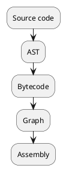
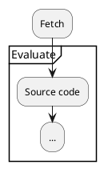

## はじめに

現代のフロントエンドはパフォーマンスが求められます。しかし、一口にパフォーマンスといっても様々な領域があります。

今回は、コンポーネントのレンダリングの観点からパフォーマンスを考えます。
また、例として React を取り上げます。UI コンポーネントライブラリとして、最も多くの利用者がいるためです。

さらに、CSR を前提とします。SSR や SSG はハイドレーションの理解が必要になり、複雑なためです。
別の機会に、SSR や SSG のパフォーマンスについて言及したいと思います。
そして、パフォーマンスの測定には、[Lighthouse](https://github.com/GoogleChrome/lighthouse) を前提とします。

## ブラウザーと JavaScript

まずは、JavaScript がどのように実行されるのか簡単に確認します。
例えば、Google Chrome の JavaScript Engine は [V8](https://v8.dev/docs#about-v8) ですが、次のように実行します。



ソースコードの取得から単純化すると次のようになります。



当たり前ですが、スクリプトを fetch することが全ての始まりであるということを認識する必要があります。

## パフォーマンス改善指針

JavaScript の実行はそのソースコードを fetch することから始まります。
この fetch が適切なタイミングで行われているのかが大切です。

`script` タグの属性には、`async` や `defer` といった属性があります。
これらの属性は、パフォーマンス改善に寄与します。しかし、これだけでは不十分な場合があります。

例えば次の例を考えます。

```html:index.html
<!DOCTYPE html>
<html lang="en">
  <body>
    <script src="/heavy.js"></script>
  </body>
</html>
```

```js:heavy.js
console.log('Long words ...')
```

`heavy.js` では、とても大きな実行ファイルであるとします。
`html` がロードされるとすぐに `heavy.js` が実行されます。

この時、いくらスクリプトタグに `async` や `defer` 属性を付与しても、[TBT](https://web.dev/i18n/tbt/) [^1] は増加します。

[^1]: Total Blocking Time

### ユーザーインタラクションと遅延戦略

`heavy.js` が、TBT スコアを悪化させました。これを改善するにはどうしたらよいでしょう。
もし、 `heavy.js` が依存関係のない独立したスクリプトで、いつ実行されてもよい場合は、遅延ロードを行えば良いでしょう。

最も単純な方法は、`setTimeout` を使うことです。

```html:index.html
<!DOCTYPE html>
<html lang="en">
  <body>
    <script type="module">
      window.addEventListener(
        'load',
        () => {
          setTimeout(() => {
            const script = document.createElement('script')
            script.src = '/heavy.js'
            script.async = true

            const body = document.querySelector('body')
            body.appendChild(script)
          }, 3000)
        },
        {
          once: true
        }
      )
    </script>
  </body>
</html>
```

例では、`setTimeout` により、リソースの読み込みが完了した３秒後に、スクリプトの fetch が開始します。
Ligthouse が計測対象とする範囲は完全にはわかりませんが、時間指定の遅延ロードにより、**計測対象から逃れる**ことができます。

また、時間指定ではなく、ユーザーインタラクション[^2] が発生するまで遅延する方法もあります。

[^2]: スクロールやクリックイベントなど、ユーザー操作により発生するイベント

### 計測対象から逃れる？

この方法は文字通り、Lighthouse の計測対象から逃れることができます。
しかし、[Loading JavaScript After User Interaction #11904](https://github.com/GoogleChrome/lighthouse/issues/11904)
では、これらの方法について、問題を先送りにさせているだけであると指摘されています。

例えば、全てのスクリプトをユーザーインタラクションまで遅延した場合、インタラクションが発生すると同時に、大量のスクリプトが取得され実行されます。
しかし、これは計測ポイントをずらしているだけで、問題の本質的な解決ではないということです。

### インターセクションオブザーバーと遅延戦略

さて、適切な遅延戦略とはなんでしょう。おそらくそのひとつは、必要になるまでは何もしないということです。
必要性の解釈はそれぞれですが、ユーザー目線で考えることで見えてくるものがあります。

例えば DOM について考えてみましょう。
リソースの読み込みが完了した時点で必要なのは、ユーザーが見える範囲の DOM の構築です。
全ての DOM を構築する必要性はありません。なぜなら、その時点でユーザーが離脱した場合、結果として余計な帯域を消費しています。

つまり、ユーザーにとって、ビューポート外の DOM は基本的には不要なものです。さらに、ダイアログやオーバーレイなど、ビューポート内であっても、
今は見えないものなども不要です。
ユーザーは見えているものにのみ興味があるはずです。

ダイアログやオーバーレイは多くの場合、ボタンのクリックなどユーザーインタラクション後に現れます。
また、ビューポート外の DOM はスクロールなどのユーザーインタラクション後に現れます。
これは、インターセクションオブザーバーにより、ビューポートと交差したかより正確に把握できます。

また、React で遅延ロードするには、`React.lazy` 関数が利用できます[^3]。

[^3]: サーバーサイドでは利用できないため、サードパーティの遅延関数を利用する必要があります。

## React.lazy の使い方

多くの方が知っていると思うので、簡単に `React.lazy` 使い方を見てみます。
基本的にはファイル分割して、コンポーネントをラップするだけです。

```tsx:Dialog.tsx
import type { FC } from 'react'
const Dialog: FC<{ open: boolean }> = ({ open }) => <dialog {...{ open }}>...</dialog>

export default Dialog
```

```tsx{4,8}
import { lazy, useState } from 'react'
import type { FC } from 'react'

const Dialog = lazy(() => import('./Dialog.tsx'))

const Index: FC = () => {
  const [isShow, chagneShow ] = useState(false)
  return {isShow && <Dialog open={isShow} /> }
}
```

`lazy` 関数に `import` 関数を渡します。これで遅延コンポーネントとなります。
遅延コンポーネントは、**必要になるまで fetch 自体が遅延**されます。

上の例では、`isShow` が `true` になるまで、遅延コンポーネントは fetch されません。
これによって、ユーザーが必要とするまで遅延することができます。

トランジションと共に遅延ロードを行うこともできます。
例えばこのブログの全文検索機能は、フルスクリーンダイアログとともに提供されています。
トランジションやフォールバックコンポーネントによって、自然な UI が高いパフォーマンスで実現されています。

是非参考にしてください。

ちなみに、全てのコンポーネントをただ `React.lazy` でラップするのはあまり意味がありません。
それどころか、[CLS](https://web.dev/cls/) [^4]  が発生するため、UX が低下する可能性があります。

[^4]: Cumulative Layout Shift

初期描写に関係ない部分に対し、ユーザーイベントに連動してスクリプトがロードされるのが理想的です。

## インターセクションオブザーバーコンポーネント

同じようにして、ビューポートに入るまでコンポーネントのレンダリングを遅延します。
インターセクションオブザーバーを使ったコンポーネントは次のようになります。

```tsx:Intersection.tsx{32,45}
import { useRef, useState, useEffect, createElement } from 'react'
import type {
  FC,
  ReactNode,
  ReactHTML,
  DetailedHTMLProps,
  HTMLAttributes
} from 'react'

const Intersection: FC<
  {
    children: ReactNode
    as?: keyof ReactHTML
    keepRender?: boolean
  } & IntersectionObserverInit &
    DetailedHTMLProps<HTMLAttributes<HTMLElement>, HTMLElement>
> = ({
  children,
  as = 'div',
  keepRender = true,
  root,
  rootMargin,
  threshold,
  ...props
}) => {
  const [isShow, setShow] = useState(false)
  const ref = useRef<HTMLElement>(null)

  useEffect(() => {
    const observer = new IntersectionObserver(
      ([entry], obs) => {
        if (entry.isIntersecting) {
          setShow(true)
          if (keepRender && ref.current) {
            obs.unobserve(ref.current)
          }
        } else {
          setShow(false)
        }
      },
      { root, rootMargin, threshold }
    )

    if (ref.current) {
      observer.observe(ref.current)
    }

    return () => observer.disconnect()
  }, [keepRender, root, rootMargin, threshold])

  return (
    <>
      {createElement(as, { ref, ...props })}
      {isShow && children}
    </>
  )
}

export default Intersection
```

やっていることは非常に単純です。`children` がビューポートに交差した時に、`isShow` が `true` になるよう、`IntersectionObserver` を登録しています。

次のように使います。

```tsx
import Intersection from 'path/to/Intersection.tsx'

import { lazy } from 'react'
const LazyComponent = lazy(() => import('path/to/Lazy.tsx'))

const Index = () => {
  return (
    <>
      ...
      <Intersection>
        <LazyComponent />
      </Intersection>
      ...
    </>
  )
}
```

ビューポート外にある場合は、次のようなマークアップ になります。

```html
<body>
  ...
  <div></div>
  ...
</body>
```

`div` タグは、交差判定に使用されます。
`div` タグが交差すると、`children` がレンダリングされます。

```html
<body>
  ...
  <div></div>
  <children />
  ...
</body>
```

また、インターセクションオブザーバーのオプションを `props` として受け取るので、交差条件を調整できます。

例えば、交差に `100px` のマージンをもたせる場合は次のようになります。

```tsx
return (
  <>
    <Intersection rootMargin="100px">
      <LazyComponent />
    </Intersection>
  </>
)
```

### 過大な DOM サイズの回避

Lighthouse の監査には "過大な DOM サイズの回避" という項目があります。これは次の条件で警告を出します。

- 合計で 1500 を超えるノードがある
- 深さが 32 ノードを超えている
- 60 を超える子ノードを持つ親ノードがある

インタラクションオブザーバーコンポーネントを使うと、交差するまでレンダリングしないため、この警告がでることはないでしょう。

ただし、DOM ツリーが大きくなると、リフローに時間がかかるようになるという事実は知っておく必要があります。
交差後の DOM を考えてみます。

交差時にレンダリングされたコンポーネントが、再びビューポートから外れた場合はどうすればよいでしょう。
2 つの選択肢があります。

- DOM ツリーから削除する
- なにもせず、Intersection Observer を `disconnect` する

どちらがいいかは一概には言えません。
ただ殆どの場合、DOM を操作するのは高コストなため、なにもしないほうがいいかもしれません。

先程の、インタラクションオブザーバーコンポーネントには `keepRender` という props でこの挙動を選択できます。

## コンポーネントの内部の最適化

React ではパフォーマンスの改善として多くの場合、コンポーネントの内部のパフォーマンスが焦点に当たります。
React はイミュータブルアプローチを採用しています。ステートの変更は、オブジェクトの同一性チェックで検知しています。

その御蔭で、データ更新フローは非常に単純になります。これは、React がシンプルだと言われる所以の一翼を担う特徴です。
一方で、ステートの更新ごとに、そのコンポーネントが再計算されなければなりません。

アーキテクチャ上、React は比較的簡単にコンポーネント内部のパフォーマンスが劣化しやすいです。それを補う手段としてメモ化があります。
`memo`、`useMemo` や `useCallback` 等はもう既に語られ尽くしている部分だと思うので、ここでは取り扱いませんが、レンダリングパフォーマンスを向上させます。

## おわりに

インターセクションオブザーバーコンポーネントは、もともとライブラリにしようと考えていました。
しかし、NPM ではインターセクション系のライブラリは非常に多く、名前空間が取れそうもありませんでした。

きちんとテストされた類似ライブラリはあると思うので、プロダクションで利用する際はそちらを利用してください。

また、今回は CSR を前提としました。SSR や SSG では、Progressive hydration のような別のアプローチが必要になります。
この領域のパフォーマンス改善についてはまた別記事で書こうと思います。
