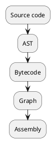
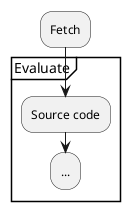

## Introduction

Today's frontend requires performance. However, performance in a nutshell covers many different areas.

In this article, we will consider performance from the perspective of component rendering.
We will also take React as an example. This is because it is the most widely used UI component library.

We will also assume CSRs, as SSRs and SSGs are more complex and require understanding of hydration.
At another time, I would like to mention the performance of SSR and SSG.
And we will assume [Lighthouse](https://github.com/GoogleChrome/lighthouse) to measure performance.

## Browsers and JavaScript

First, let's take a quick look at how JavaScript is executed.
For example, Google Chrome's JavaScript Engine is [V8](https://v8.dev/docs#about-v8), but you can run it as follows:



Simplifying from getting the source code, it looks like this:



Obviously, you need to realize that fetching the script is the beginning of everything.

## Performance Improvement Guidelines

The execution of JavaScript starts with fetching its source code.
It is important to make sure that this fetch is done at the right time.

The `script` tag has attributes such as `async` and `defer`.
These attributes contribute to performance improvement. However, there are times when this is not enough.

For example, consider the following example.

```html:index.html
<!DOCTYPE html>
<html lang="en">
  <body>
    <script src="/heavy.js"></script>
  </body>
</html>
```

```js:heavy.js
console.log('Long words ...')
```

For `heavy.js`, let's say it's a very large executable.
As soon as the `html` is loaded, `heavy.js` will be executed.

At this time, Even if you add `async` or `defer` attributes to the script tag, [TBT](https://web.dev/i18n/tbt/) [^1] will increase.

[^1]: Total Blocking Time

### User Interaction and Lazy Strategies

`heavy.js` is making my TBT score worse. What can we do to improve this?
If `heavy.js` is an independent script with no dependencies, and can be executed at any time, you can lazy load it.

The simplest way is to use `setTimeout`.

```html:index.html
<!DOCTYPE html>
<html lang="en">
  <body>
    <script type="module">
      window.addEventListener(
        'load',
        () => {
          setTimeout(() => {
            const script = document.createElement('script')
            script.src = '/heavy.js'
            script.async = true

            const body = document.querySelector('body')
            body.appendChild(script)
          }, 3000)
        },
        {
          once: true
        }
      )
    </script>
  </body>
</html>
```

In the example, `setTimeout` will cause the script to start fetching 3 seconds after the resource has finished loading.
We don't know the full extent of Ligthouse's measurement coverage, but lazy loading allows us to **get out of the measurement**.

Alternatively, you can delay until a user interaction [^2] occurs.

[^2]: Events that are triggered by user actions, such as scrolling or clicking events.

### Get out of the measurement?

This method allows you to literally escape Lighthouse's measurements.
However, [Loading JavaScript After User Interaction #11904](https://github.com/GoogleChrome/lighthouse/issues/11904) pointed out that these methods only let the problem be postponed.

For example, if you delay all scripts until the user interaction, a large number of scripts will be fetched and executed as soon as the interaction occurs.
However, this only shifts the measurement point and does not essentially solve the problem.

### Intersection Observers and Lazy Strategies

Now, what is a proper delay strategy? Perhaps one of them is to do nothing until it is needed.
Necessity can be interpreted in different ways, but there are things that can be seen by thinking from the user's perspective.

For example, let's consider the DOM.
When the resource loading is complete, all that is needed is to build the DOM as far as the user can see.
There is no need to build the entire DOM. This is because if the user leaves at that point, you are consuming extra bandwidth as a result.

In other words, for the user, the DOM outside the viewport is basically unnecessary. Furthermore, dialogs, overlays, and other things that are in the viewport but not currently visible are also unnecessary.
The user only needs what is visible.

Dialogs and overlays often appear after a user interaction, such as clicking a button.
Also, the DOM outside the viewport will appear after user interaction such as scrolling.
This is where the Intersection Observer comes in to provide a more accurate picture of where the viewport intersects.

Also, for lazy loading in React, the `React.lazy` function can be used [^3].

[^3]: This is not available on the server side, so you will need to use a third party lazy function.

## React.lazy usage

Let's take a quick look at the `React.lazy` usage, as I'm sure many of you know it.
Basically, it just splits the files and wraps the components.

```tsx:Dialog.tsx
import type { FC } from 'react'
const Dialog: FC<{ open: boolean }> = ({ open }) => <dialog {...{ open }}>...</dialog>

export default Dialog
```

```tsx{4,8}
import { lazy, useState } from 'react'
import type { FC } from 'react'

const Dialog = lazy(() => import('./Dialog.tsx'))

const Index: FC = () => {
  const [isShow, chagneShow ] = useState(false)
  return {isShow && <Dialog open={isShow} /> }
}
```

Pass the `import` function to the `lazy` function. This makes it a lazy component.
The lazy component will **delay the fetch itself** until it is needed.

In the example above, the lazy component will not be fetched until `isShow` is `true`.
This allows you to delay it until the user needs it.

Lazy loading can also be done with transitions.
For example, the full-text search feature of this blog is provided with a full-screen dialog.
With transitions and fallback components, a natural UI is achieved with high performance.

Please refer to it.

By the way, it doesn't make much sense to just wrap all components in `React.lazy`.
On the contrary, it may cause [CLS](https://web.dev/cls/) [^4], which may degrade the UX.

[^4]: Cumulative Layout Shift

## Intersection Observer component

In the same way, we will delay the rendering of the component until it enters the viewport.
A component with an intersection observer would look like this:

```tsx:Intersection.tsx{32,45}
import { useRef, useState, useEffect, createElement } from 'react'
import type {
  FC,
  ReactNode,
  ReactHTML,
  DetailedHTMLProps,
  HTMLAttributes
} from 'react'

const Intersection: FC<
  {
    children: ReactNode
    as?: keyof ReactHTML
    keepRender?: boolean
  } & IntersectionObserverInit &
    DetailedHTMLProps<HTMLAttributes<HTMLElement>, HTMLElement>
> = ({
  children,
  as = 'div',
  keepRender = true,
  root,
  rootMargin,
  threshold,
  ...props
}) => {
  const [isShow, setShow] = useState(false)
  const ref = useRef<HTMLElement>(null)

  useEffect(() => {
    const observer = new IntersectionObserver(
      ([entry], obs) => {
        if (entry.isIntersecting) {
          setShow(true)
          if (keepRender && ref.current) {
            obs.unobserve(ref.current)
          }
        } else {
          setShow(false)
        }
      },
      { root, rootMargin, threshold }
    )

    if (ref.current) {
      observer.observe(ref.current)
    }

    return () => observer.disconnect()
  }, [keepRender, root, rootMargin, threshold])

  return (
    <>
      {createElement(as, { ref, ...props })}
      {isShow && children}
    </>
  )
}

export default Intersection
```

What we are doing is very simple. We register an `IntersectionObserver` so that `isShow` is `true` when `children` intersect the viewport.

It is used as follows:

```tsx
import Intersection from 'path/to/Intersection.tsx'

import { lazy } from 'react'
const LazyComponent = lazy(() => import('path/to/Lazy.tsx'))

const Index = () => {
  return (
    <>
      ...
      <Intersection>
        <LazyComponent />
      </Intersection>
      ...
    </>
  )
}
```

If it is outside the viewport, the markup will look like this:

```html
<body>
  ...
  <div></div>
  ...
</body>
```

The `div` tag is used for intersection detection.
If the `div` tag intersects, the `children` will be rendered.

```html
<body>
  ...
  <div></div>
  <children />
  ...
</body>
```

It also accepts intersection observer options as `props`, so you can adjust the intersection conditions.

For example, if you want the intersection to have a margin of `100px`, you can use the following.

```tsx
return (
  <>
    <Intersection rootMargin="100px">
      <LazyComponent />
    </Intersection>
  </>
)
```

### Avoid an excessive DOM size

In the Lighthouse audit, there is a section called "Avoid an excessive DOM size". This will alert you if

- There are more than 1500 nodes in total
- Depth is greater than 32 nodes
- There is a parent node with more than 60 child nodes

If you use the Interaction Observer component, you will not get this warning because it does not render until it intersects.

However, you should be aware of the fact that the larger the DOM tree gets, the longer it will take to reflow.
Let's consider the DOM after the intersection.

What should we do if the component rendered during the intersection is out of the viewport again?
There are two options

- Remove it from the DOM tree
- Do nothing and `disconnect` the Intersection Observer.

It's hard to say which is better.
In most cases, it is better to do nothing, because manipulating the DOM is expensive.

The Interaction Observer component has a `keepRender` props that allows you to choose this behavior.

## Optimizing the internals of components

In React, performance improvements often focus on the internals of components.
React uses an immutable approach. State changes are detected by object identity checks.

Thanks to this, the data update flow is very simple. This is one of the reasons why React is considered simple.
On the other hand, each time a state is updated, its components have to be recomputed.

Due to its architecture, React is prone to performance degradation inside components relatively easily. Memoization is a way to compensate for this.
Improve rendering performance such as `memo`, `useMemo` and `useCallback`.

## Conclusion

The intersection observer component was originally intended to be a library.
However, there are so many intersection libraries in NPM that it was not possible to get a namespace for it.

I believe there are similar libraries that have been properly tested, so please use those if you are using them in production.

For SSR and SSG, a different approach such as progressive hydration is required.
I will write more about performance improvement in this area in another article.
