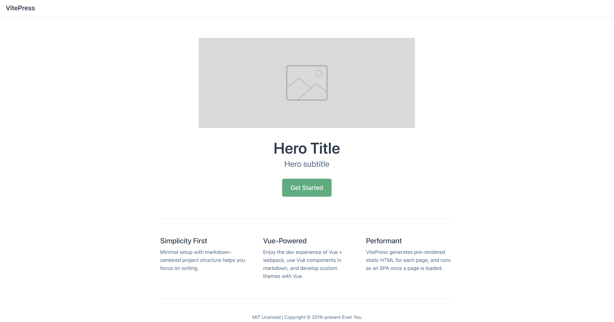
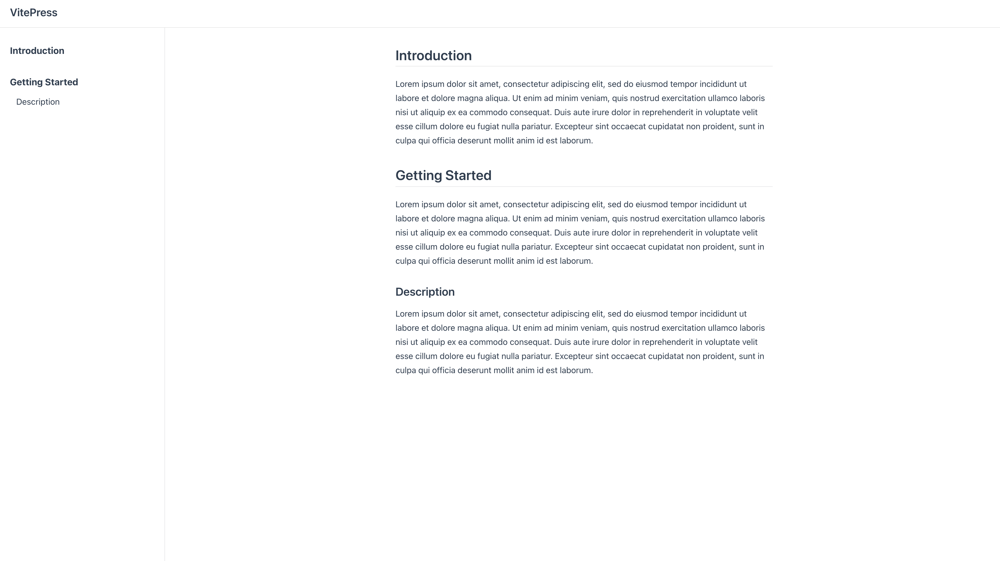
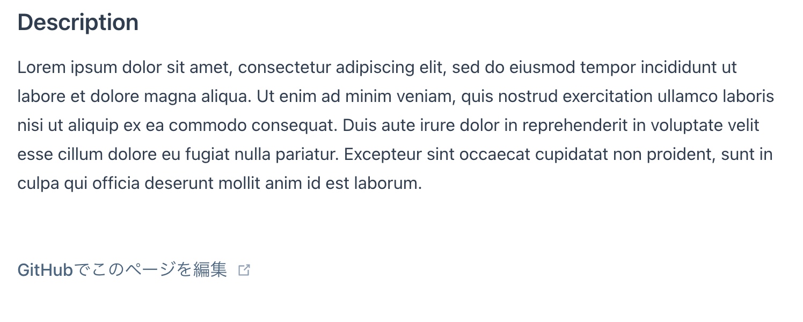
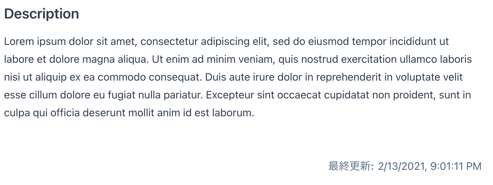
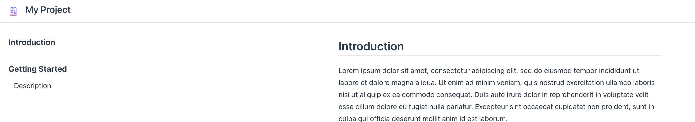
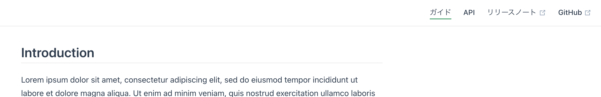
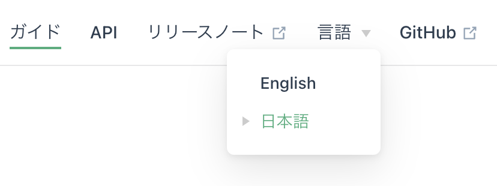
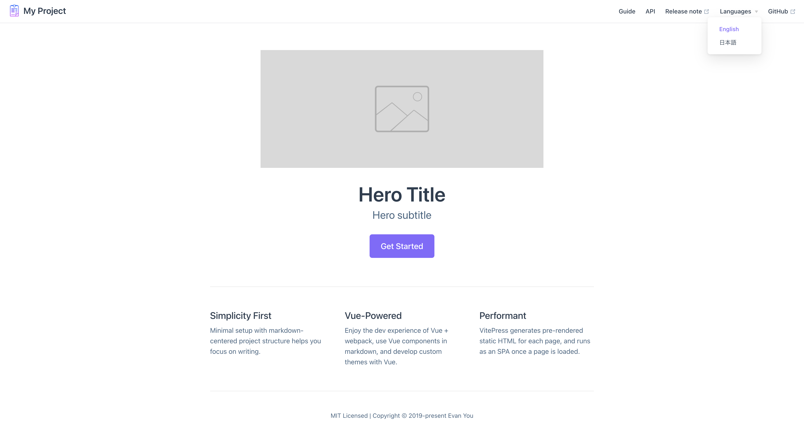

## はじめに

こんにちは。みなさんはドキュメントを作成する際、どんなツールを使っていますか？今回、紹介するのは VitePress という静的サイトジェネレーターです。
VitePress は Vue ベースで SSG ができるためドキュメントの生成などに便利です。
[公式](https://vitepress.vuejs.org/)では、次のように紹介しています。

> VitePress is VuePress' little brother, built on top of Vite.

VuePress は Vue と WebPack を用いて SSG をしていますが、VitePress は Vue と Vite を使っている点が異なります。ビルドに Vite を使っている点が新しく、開発サーバーの立ち上げが爆速です:rocket:。
また、カスタムコンポーネントととして、Vue のコンポーネントをマークダウンに埋め込むこともできますが、Vue についての知識は一切必要なく、ドキュメントを作成することができます。

今回は、そんな VitePress の基本的な使い方から、ドキュメントにはまだ記載のない多言語対応、ホームページレイアウト、メタタグのインジェクション、カスタムコンポーネント、カスタム CSS の適応方法などについても紹介したいと思います。

なお、検証として、以下のバージョンを用いました。

```bash
vitepress v0.12.0
```

## 開発環境

まずは開発環境を作ります。Node.js やパッケージマネージャーはインストール済みとして進めます。
また、パッケージマネージャーに Yarn を前提するので適宜読み替えてください。

さて、適当なディレクトリに VitePress をインストールします。

```bash
yarn add -D vitepress
```

ドキュメントのルートディレクトリを決めます。
今回は`docs` とします。さらに、ドキュメントルートに`index.md`を追加します。

```bash
mkdir docs
echo '# Hello VitePress' > docs/index.md
```

`package.json`には次のスクリプトを追加すると便利です。
`docs`をドキュメントルートにしたので、スクリプトもそれに合わせます。

```json:package.json
{
  "scripts": {
    "docs:dev": "vitepress dev docs",
    "docs:build": "vitepress build docs",
    "docs:serve": "vitepress serve docs"
  }
}
```

`docs:dev`コマンドを実行すると、開発サーバーが立ち上がります。
これで準備完了です。

## ファイル構造

まずは VitePress のファイル構造を理解しましょう。VitePress ではドキュメントルートから次のようなファイル構造にする必要があります。

```bash
docs
├── index.md
├── en.md
├── ja
│   └── index.md
├── public
└── .vitepress
    └──config.js
```

`.vitepress`以下では、Vitepress のメタ情報やテーマ、レイアウトなどをカスタマイズできます。
当然、カスタマイズは一切なくてもちゃんと動作するので、必要に応じて設定しましょう。

### マークダウンファイルと URL パス

ファイル構造を一つづつ見ていくと、まずルート以下の`*.md`ファイルは、ファイルパスがそのまま URL パスとなります。
ここでは`index.md`、`en.md`、`ja/index.md`３つのファイルがありますが、これによって次の URL でアクセスできるページを生成します。

| File          | URL      |
| ------------- | -------- |
| `index.md`    | /        |
| `en.md`       | /en.html |
| `ja/index.md` | /ja/     |

`index.md`の場合は、スラッシュで終わるパスを、それ以外は、`.html`を追加したパスであれば、正しいページをロードできます。

## レイアウト

VitePress には２つの組み込みレイアウトがあります。これらは`.md`のフロントマッターから制御できます。

### ホームレイアウト

ホームレイアウトは次のようなレイアウトです。


これは `.md`で設定できます。

```md:index.md
---
home: true
---
```

他にも、以下の項目を設定可能です。

```md:index.md
---
home: true

heroImage: /logo.png
heroAlt: Logo image
heroText: Hero Title
tagline: Hero subtitle
actionText: Get Started
actionLink: /guide/
features:
- title: Simplicity First
  details: Minimal setup with markdown-centered project structure helps you focus on writing.
- title: Vue-Powered
  details: Enjoy the dev experience of Vue + webpack, use Vue components in markdown, and develop custom themes with Vue.
- title: Performant
  details: VitePress generates pre-rendered static HTML for each page, and runs as an SPA once a page is loaded.
footer: MIT Licensed | Copyright © 2019-present Evan You
---
```

`heroImage`や`heroAlt`はメインの`img`タグに対する、`src`と`alt`属性を指定します。
ちなみに`heroImage`のようにスラッシュから始めるパスを指定すると、public ディレクトリにあるファイルを参照します。

`actionText`と`actionLink`でリンクボタンを追加できます。
また、`features`に`title`と`details`の配列を追加すると、プロジェクトの特徴をいい感じに出力できます。

`footer`には footer タグを追加できます。

これらを設定することで、次のようなレイアウトを作れます。



### ドキュメントレイアウト

続いてドキュメントレイアウトですが、こちらは基本的にはマークダウンを書いていくだけで、次のようなレイアウトになります。


ここで`title`タグについて見てみます。デフォルトでは、`title` タグは次のようになっています。

```html
<head>
  <title>VitePress</title>
</head>
```

ここでマークダウンとして`h2`タグを追加すると、自動的に h2 のコンテンツがタイトルに追加されます。

```html
<head>
  <title>Introduction | VitePress</title>
</head>
```

また、この自動挿入はフロントマッターに設定することで制御できます。

```md:index.md
---
title: Hello
---
```

```html
<head>
  <title>Hello | VitePress</title>
</head>
```

ちなみにホームレイアウトのタイトルは Home 固定なので、変更できないようです。

タイトルのプロジェクト名の変更については、後述するグローバル設定から変更できます。

### head タグ設定

どちらのレイアウトにも共通する設定として、`head` タグを設定できます。後述しますが、`head` タグをグローバルに設定する方法もありますが、
ページに設定したものが優先されます。

```md
---
description: Hello document
head:
  - - meta
    - property: og:title
      content: Hello

    - link
    - rel: preconnect
      href: https://test.com
---
```

このように`head`に `meta` 要素や `link` 要素を設定できます。これによって、OGP 関連のタグなども問題なく書くことができます。

さてここまでで、マークダウンのフロントマッターでのカスタマイズ方法について見てきました。
続いては、`config.js` ファイルを使って、グローバルなカスタム設定について見ていきましょう。

## グローバル設定

まずは設定ファイルの型定義を見てみましょう。

```ts
interface UserConfig<ThemeConfig = any> {
  lang?: string
  base?: string
  title?: string
  description?: string
  head?: HeadConfig[]
  themeConfig?: ThemeConfig
  locales?: Record<string, LocaleConfig>
  alias?: Record<string, string>
  markdown?: MarkdownOptions
  customData?: any
}
```

今回はこの中から、 `alias`、`markdown`、`customData`を除いた各項目について説明します。

また、この設定ファイルは`.js`でしか認識されません。残念ながら Typescript で型補完しながらというのはできませんが、
次のように JSDoc で型補完をするといいでしょう。

```js:config.js
/**
 * @type {import('vitepress').UserConfig}
 */
module.exports = {
  title: '',
  ...
}
```

### lang

`lang`プロパティでは`html`タグの`lang`属性を変更できます。
`$siteByRoute`や`$site`といった VitePress 用の組み込み属性に追加されるので、
`.vue`コンポーネントを作って組み込む際にも使えます。

### title

`title`プロパティでは`head`タグの`title`のプロジェクト名を設定ができます。

```html
<head>
  <title>Hello | My Project</title>
</head>
```

### base

`base`プロパティは、 GitHub ページなどのサブパスの下にサイトをデプロイする場合に設定する必要があります。
例えば`https://foo.github.io/bar/`という URL にデプロイする場合、`/bar/`  を設定します。

```js:config.js
module.exports = {
  base: '/bar/',
}
```

### description

`description`プロパティでは`head`タグの`description`を設定ができます。

```html
<head>
  <meta name="description" content="This is my project" />
</head>
```

ただし、マークダウンのフロントマッターに`description`にある場合は、そちらが優先されます。

### head

`head`プロパティは`head`タグを挿入できます。
ページごとに設定するのではなくプロジェクト全体に設定したいときに便利です。
2 重配列で若干わかりにくいので、例示しておきます。

```js:config.js
module.exports = {
  head: [
    ['meta', { property: 'og:description', content: 'description' }],
  ]
}
```

ページにも設定されている場合は、ページが優先されます。

### themeConfig

`themeConfig`プロパティでは、GitHub の編集リンクの制御や、ナビゲーションの設定を行えます。少し要素が多いので一気に見ていきます。

#### GitHub 編集リンク

GitHub のレポジトリやブランチを設定することで、GitHub の編集リンクを自動生成できます。ページ上部のナビゲーションにもリンクが追加されます。

```js:config.js
module.exports = {
  themeConfig: {
      editLinks: true,
      editLinkText: 'GitHubでこのページを編集',
      repo: 'TomokiMiyauci/file-select-dialog',
      docsDir: 'docs',
      docsBranch: 'main',
  }
}
```



`docsDir`は GiHub 上のドキュメントルートを指定します。基本的には、最初に設定したドキュメントルートと同じで問題ありません。

#### lastUpdated

`lastUpdated`プロパティで記事の最終更新日を自動生成できます。

```js:config.js
module.exports = {
  themeConfig: {
    lastUpdated: '最終更新'
  }
}
```



#### logo

`logo`プロパティで上部にロゴを設定できます。


このロゴは画像サイズによって位置がずれたりしますが、後述のカスタム CSS によって修正します。

#### nav

`nav`プロパティで上部にナビゲーションを設定できます。

```js:config.js
module.exports = {
  themeConfig: {
    nav: [
      { text: 'ガイド', link: '/ja/' },
      {
        text: 'API ',
        link: '/ja/api',
        activeMatch: '^/ja/api'
      },
      {
        text: 'リリースノート',
        link:
          'https://github.com/TomokiMiyauci/file-select-dialog/blob/main/CHANGELOG.md'
      }
    ],
  }
}
```



ここまでで、いい感じにドキュメントが作成されるようになっています。
このままでももちろんいいですが、Vitepress ではまだまだカスタマイズできる要素があります。

ここからは、＋アルファとして多言語対応や、カスタムコンポーネント、カスタム CSS について説明します。

## 多言語対応

[マークダウンファイルと URL パス](#マークダウンファイルと-url-パス)にあるように、Vitepress はファイルベースでパスを生成します。
そのため、多言語の設定には、違う言語のマークダウンファイルを用意することと、
言語の切替えができればいいです。

言語の切替えについては、組み込みのメニューコンポーネントがあります。その設定について見てみましょう。

```js:config.js
module.exports = {
  themeConfig: {
    locales: {
      '/': {
          label: 'English',
          selectText: 'Languages',
      },
      '/ja/': {
          label: '日本語',
          selectText: '言語',
      },
    }
  }
}
```


これによって言語の切換えができます。便利ですね:sparkles:。

また、`locales`プロパティで、上で説明した`themeConfig`のプロパティを設定できます。例えば、`editLinkText`を言語によって変える場合は以下のようにします。
`locales`に指定した key が URL パスにマッピングされます。

```js:config.js
module.exports = {
  themeConfig: {
    locales: {
      '/': {
        editLinkText: 'edit on GitHub'
      },
      '/ja/': {
        editLinkText: 'GitHubでこのページを編集',
      },
    },

    editLinks: true
  }
}
```

さらに`locales`にない場合は`themeConfig`のプロパティにフォールバックします。`editLinks`は言語間で共通なので、上の例のように設定できます。

`themeConfig`だけではなく、`head`タグも多言語化可能です。例えば、`description`プロパティを多言語対応するには次のようにします。

```js:config.js
module.exports = {
  locales: {
      '/': {
          description: 'locale En',
      },
      '/ja/': {
          description: 'locale Ja',
      }
  }
}
```

まとめると`config.js`は次のようになります。長くなってしまいましたが、例として活用してください。

ポイントは`locales`プロパティは`head`タグを変更する部分と、`themeConfig`プロパティの両方に設定できるということです。
OGP タグなどは省略してるものもあるので、適宜追加してください。

```js:config.js
module.exports = {
  title: 'My Project',
  head: [
    ['meta', { property: 'og:title', content: 'My Project' }],
  ],
  locales: {
      '/': {
          description: 'locale En',
      },
      '/ja/': {
          description: 'locale Ja',
      }
  },
  themeConfig: {
    editLinks: true,
    editLinkText: 'GitHubでこのページを編集',
    repo: 'TomokiMiyauci/file-select-dialog',
    docsDir: 'docs',
    docsBranch: 'main',
    logo: '/logo2.png',
    locales: {
      '/': {
          label: 'English',
          selectText: 'Languages',
          editLinkText: 'edit on GitHub',
          lastUpdated: 'Last Updated',
          nav: [
            { text: 'guide', link: '/guide/' },
            {
              text: 'API',
              link: '/api/',
            },
            {
              text: 'Release note',
              link:
                'https://github.com/TomokiMiyauci/file-select-dialog/blob/main/CHANGELOG.md'
            }
        ],
      },
      '/ja/': {
          label: '日本語',
          selectText: '言語',
          editLinkText: 'GitHubでこのページを編集',
          lastUpdated: '最終更新',
          nav: [
            { text: 'ガイド', link: '/ja/guide/' },
            {
              text: 'API ',
              link: '/ja/api/',
            },
            {
              text: 'リリースノート',
              link:
                'https://github.com/TomokiMiyauci/file-select-dialog/blob/main/CHANGELOG.md'
            }
        ],
      },
    }
  }
}
```

## カスタムコンポーネント

マークダウンに Vue コンポーネントを使いたいこともあるでしょう。
VitePress ではもちろんそのケースもほとんど設定せずにできます。
まずは、`.vitepress`ディレクトリ以下に`components`ディレクトリを作り、
そこに適当なコンポーネントを作ります。`components`という名称は何でも大丈夫です。

```bash
docs
 index.md
└── .vitepress
    ├──config.js
    └──components
        └──Playground.vue
```

```html:Playground.vue
<template>
    <button @click="onClick">Increase</button>
</template>

<script setup lang="ts">
import { ref } from 'vue'

const count = ref<number>(0)
const onClick = ():void => {
    count.value++
}
</script>
```

次にこのコンポーネントをグローバルに登録します。ここは Vue3 と同じ流れですね。
`.vitepress`ディレクトリ以下に`theme`ディレクトリを作り、`index.js`ファイルを作成します。

```bash
docs
└── .vitepress
    ├──config.js
    ├──components
    │  └──Playground.vue
    └── theme
        └── index.js
```

```js:index.js
import Theme from 'vitepress/theme'
import Playground from '../components/Playground.vue'

export default {
  ...Theme,

  enhanceApp({ app }) {
    app.component('playground', Playground)
  }
}
```

`index.js`の`enhanceApp`というプロパティに Vue インスタンスが渡されるので、グローバルコンポーネントとして設定します。
また、`Theme`は VitePress デフォルトのレイアウト等を使う場合は必須です。

あとはマークダウンファイルに直接コンポーネントを配置します。

```md:index.md
## Introduction

<playground />
```

## カスタム CSS

スタイルを上書きしてテーマカラーやロゴサイズを変更できます。
まずは CSS Variables を見てみます。

```css
:root {
  --c-white: #ffffff;
  --c-black: #000000;
  --c-divider-light: rgba(60, 60, 67, 0.12);
  --c-divider-dark: rgba(84, 84, 88, 0.48);
  --c-text-light-1: #2c3e50;
  --c-text-light-2: #476582;
  --c-text-light-3: #90a4b7;
  --c-brand: #3eaf7c;
  --c-brand-light: #4abf8a;
  --font-family-base: -apple-system, BlinkMacSystemFont, 'Segoe UI', Roboto,
    Oxygen, Ubuntu, Cantarell, 'Fira Sans', 'Droid Sans', 'Helvetica Neue',
    sans-serif;
  --font-family-mono: source-code-pro, Menlo, Monaco, Consolas, 'Courier New',
    monospace;
  --z-index-navbar: 10;
  --z-index-sidebar: 6;
  --shadow-1: 0 1px 2px rgba(0, 0, 0, 0.04), 0 1px 2px rgba(0, 0, 0, 0.06);
  --shadow-2: 0 3px 12px rgba(0, 0, 0, 0.07), 0 1px 4px rgba(0, 0, 0, 0.07);
  --shadow-3: 0 12px 32px rgba(0, 0, 0, 0.1), 0 2px 6px rgba(0, 0, 0, 0.08);
  --shadow-4: -2 14px 44px rgba(0, 0, 0, 0.12), 0 3px 9px rgba(0, 0, 0, 0.12);
  --shadow-5: 0 18px 56px rgba(0, 0, 0, 0.16), 0 4px 12px rgba(0, 0, 0, 0.16);
  --header-height: 3.6rem;
}
```

これらは簡単に変更できるので、ブランドカラーを変更してみます。また、ロゴの大きさも変更します。
変更には CSS ファイルに上書きしたいプロパティを定義して、`theme/index.js`でインポートします。

```css:theme/custom.css
:root {
  --c-brand: #8664ff;
  --c-brand-light: #8974ff;
}

.nav-bar .logo {
  height: 30px;
  margin-right: 2px;
}
```

```js:theme/index.js
import './custom.css'

export default {}
```

このように色やロゴの大きさを変更できました。


## まとめ

VitePress でドキュメントの作成を見てきました。

現在、Vitepress はミニマムということにかなりこだわっており、その役割をドキュメントの生成に専念させるのか、ブログ用などのために機能の追加を行うのか議論されています。
まだまだ、発展の余地があり細かいところにバグはありますが、今後の動向にも期待したいです。
