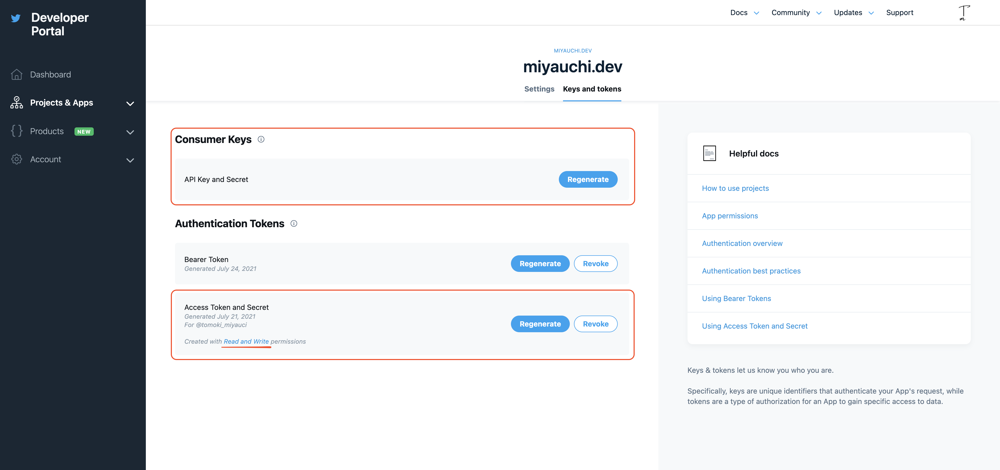

## Introduction

This article introduces how to tweet dynamically from a program.

This is a part of automatic tweeting, so it may be useful to apply it.

In this article, I will focus on [`twitter-api-v2`](https://www.npmjs.com/package/twitter-api-v2), which is recommended among many Twitter clients.

## Selecting a Twitter Client

First of all, the decision is whether or not to use the Client library, but personally I think you should.

Let's take a look at [Official example](https://developer.twitter.com/en/docs/twitter-api/v1/tweets/post-and-engage/api-reference/post-statuses-update).

```bash
curl -XPOST
  --url 'https://api.twitter.com/1.1/statuses/update.json?status=hello'
  --header 'authorization: OAuth
  oauth_consumer_key="oauth_customer_key",
  oauth_nonce="generated_oauth_nonce",
  oauth_signature="generated_oauth_signature",
  oauth_signature_method="HMAC-SHA1",
  oauth_timestamp="generated_timestamp",
  oauth_token="oauth_token",
  oauth_version="1.0"'
```

In order to tweet from a program, you need to calculate the oauth_signature.
The oauth_signature needs to be a signature base string[^1] and a signing key[^2] hashed with `HMAC-SHA1`[^3].

[^1]: HTTP method, base URL, and seven parameter strings.
[^2]: `Consumer secret` and `OAuth token secret`, percent-encoded and concatenated with `&`.
[^3]: See the [official documentation](https://developer.twitter.com/ja/docs/basics/authentication/guides/creating-a-signature) for details.

This work is not very essential, so unless the size of your codebase is severe, you should avoid redevelopment and use the library straightforwardly.

Now, there are many Twitter Client libraries available for `Node.js`.

Basically, the `Declaretion file` is provided, so you can use it with TypeScript without any problem.
So, you can use anything you want.
If you want to tweet programmatically, I recommend `twitter-api-v2`.

I think the most famous Client library is [`twitter`](https://www.npmjs.com/package/twitter), but compared to it, `twitter-api-v2` has the following three features.

- Small package size
- Strong typing
- Promise based

Let's look at each of them briefly.

### Smaller package size

The package size is about 1/15th of the size of the `twitter` client.
Since the Twitter Client is used on the server side, the package size is not that critical.

However, in a serverless environment, it affects the image size of containers, etc., and also affects the speed of workflow due to the installation time, so smaller is better.

Since `twitter-api-v2` has no dependency packages, the size can be reduced considerably.

### Strong typing

All Twitter client libraries are essentially wrappers for requests to endpoints.

The library frees you from the hassle of creating AOuth headers. However, in most of them, the response type is a weak type such as `any`.
There is a reason for this. Libraries other than `twitter-api-v2` are implemented to be thin wrappers for HTTP clients.

For example, a request to the following endpoint using a `twitter` client would look like this

https://api.twitter.com/1.1/statuses/update.json

```ts
import Twitter from 'twitter'
import type { ResponseData } from 'twitter'
import type { Response } from 'request'

const client = new Twitter(credentials)
client.post(
  'statuses/update',
  {
    status: 'tweet content'
  },
  (error, responseData, response) => {
    error // any
    resonseData // ResponseData
    response // Response
  }
)
```

The response can be obtained by a callback function.
If you look at the callback function for the response, you will see that the first argument is of type `any`.
Also, the second argument returns the type `ResponseData`. The actual type is

```ts
interface ResponseData {
  [key: string]: any
}
```

Also, the third argument returns the `Response` type of [`request`](https://www.npmjs.com/package/request). From this, we can infer that `twitter` is using `request` for http requests.
Unfortunately, these three arguments are not type-safe.

On the other hand, if you use `twitter-api-v2`, you will get the following.

```ts
import Twitter, { TweetV1 } from 'twitter-api-v2'

const client = new Twitter(credentials)
const result = await client.v1.tweet('tweet content')

result // TweetV1
```

Because `twitter-api-v2` has a dedicated interface for tweets, user information, and media information, it can be used as a
Strong typing allows safe handling of the response.

If you just want to tweet, you may not need to be too strict with error handling, but type safety is always a good thing.

### Promise-based

As already shown in the example, `twitter-api-v2` returns a Promise object.
I don't think I need to go into the advantages of being a `Promise`, but it makes for highly readable code.

As you can see above, if you want to tweet using `Node.js`, `twitter-api-v2` is a better choice.

## Tweeting

Now, let's actually tweet. It is assumed that you have already registered for the [Twitter developer platform](https://developer.twitter.com/en).

First, create a project and generate an API key from the Twitter Developer Portal.



From Customer Keys

- API Key
- API Secret Key

and

From Authentication Tokens

- Access Token
- Access Token Secret

can be obtained from Authentication Tokens.
At this point, you need to pay attention to the permissions of Authentication Tokens.

There are three types of permissions as follows:

- Read only
- Read and write
- Read, write and access Direct Messages

If the token is to be used for tweeting, the permissions must be greater than or equal to `Read and Write`.
If it is `Read only`, you will need to change the permissions and regenerate the token.

Now that you have the four values, the rest is easy.

First, you need to install `twitter-api-v2`.

<CodeGroups>
  <CodeGroup label="Yarn" active>

```bash
yarn add -D twitter-api-v2
```

  </CodeGroup>

  <CodeGroup label="NPM">

```bash
npm i -D twitter-api-v2
```

  </CodeGroup>
</CodeGroups>

The constructor is given four values. The names of the keys in the interface are slightly different.

| Developer Portal    | Constractor  |
| ------------------- | ------------ |
| API Key             | appKey       |
| API Secret Key      | appSecret    |
| Access Token        | accessToken  |
| Access Token Secret | accessSecret |

```ts
import Twitter from 'twitter-api-v2'

const client = new Twitter({
  appKey,
  appSecret,
  accessToken,
  accessSecret
})

client.v1.tweet('test')
```

I hope you are now able to tweet. If not, you may want to review the permissions.

## Error handling

Basically, the above example is fine, but there are some patterns that cause errors.
These are duplicate tweets and rate limits.

In the case of errors, both of them will result in a 403 error.

### Duplicate Tweet

The content of the tweet is compared with the most recent tweets, and if there are duplicates, an error will be generated.

It is important to note that not only the **most recent tweets** will be compared.
The most recent tweet is compared to tweets made in a relatively close period of time, and the specification seems to be such that the same content cannot be tweeted.

### Rate limit

You can only send less than 300 tweets in 3 hours. This includes retweets, so if you're retweeting from a program, you need to be careful about the limit.

Both errors will call the `reject` method of Promise.
So you can either supplement it with `try-catch` as you would normally do with error handling, or with Promise's `catch` method.
